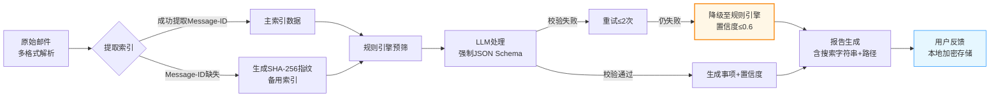

 **mailCopilot 产品需求文档（PRD）**  
**版本**：V2.0 
**日期**：2026年1月30日  
**核心升级**：事项可溯源 · 准确性可验证 · 用户可校正 · 技术可落地  

---

## 一、产品概述
### 1.1 产品目标
> **核心价值**：将用户私有邮件转化为**结构化可执行任务清单**，在本地处理隐私零泄露的前提下，实现100%人工可验证的事项溯源  
> **成功指标**（V2.0 MVP）：  
> - ✅ 首次配置完成率 ≥80%  
> - ✅ **事项可溯源率 100%**（每个事项含完整邮件索引或备用指纹）  
> - ✅ **用户对事项准确性的满意度 ≥4.0/5.0**（调研）  
> - ✅ **低置信度事项复核提示覆盖率 100%**  

### 1.2 准确性设计原则
| 原则 | 说明 | 用户价值 |  
|------|------|----------|  
| **可溯源** | 每个事项绑定原始邮件唯一标识（Message-ID）或备用指纹（SHA-256） | 用户可通过搜索字符串在邮件客户端中秒级定位原始上下文 |  
| **可验证** | 报告内嵌邮件关键元数据（发件人/时间/主题片段/文件路径） | 无需切换窗口即可交叉验证，复制搜索关键词至邮件客户端即可查看原文 |  
| **可校正** | 提供轻量反馈入口（✓/✗），用户修正即优化本地规则 | 用户成为准确性共建者，数据本地加密存储 |  
| **可感知** | 置信度可视化 + 低置信度主动提示 | 用户清晰掌握哪些事项需重点关注，决策权在用户手中 |  

---

## 二、用户场景与故事
### 2.1 关键用户故事

| 优先级 | 用户故事 | 验收标准 |  
|--------|----------|----------|  
| **P0** | 作为用户，我需要每个事项都能**精准追溯到原始邮件**，以便验证内容真实性 | 1. 报告中每个事项显示：发件人、日期、主题关键词、Message-ID或文件路径<br>2. 提供"复制搜索关键词"按钮（格式：`from:xxx subject:xxx date:xxx`），用户可粘贴至任意邮件客户端搜索<br>3. 100%事项含有效索引或指纹，无"来源不明"事项 |  
| **P0** | 作为严谨用户，我需要系统**主动提示低置信度事项**，避免遗漏关键错误 | 1. 置信度<0.6的事项自动标注"[来源待确认]"<br>2. 报告顶部汇总提示"发现N条需复核事项"<br>3. 低置信度事项高亮显示（浅黄色背景） |  
| **P0** | 作为用户，我希望**在隐私绝对安全的前提下反馈错误**，帮助系统持续优化 | 1. 每个事项旁有"✓/✗"反馈按钮<br>2. 点击"✗"弹出简短原因选项（"内容错误"/"优先级错误"/"非事项"/"来源错误"）<br>3. 反馈数据本地加密存储于应用数据目录，不上传<br>4. 设置页提供"反馈统计"和"立即销毁所有反馈数据"功能 |  

---

## 三、功能需求详述

### 3.1 事项溯源与索引模块

| 需求ID | 需求描述 | 用户价值 | 技术实现与降级策略 |
|--------|----------|----------|-------------------|
| **TRACE-01** | **双轨索引机制**：<br>1. 主索引：提取邮件Message-ID（RFC 5322标准）<br>2. 备用索引：计算邮件内容SHA-256指纹（前1KB+附件列表哈希） | 消除邮件重复/混淆风险，兼容不标准邮件头 | 当Message-ID缺失（部分转发邮件/自动通知），自动降级为指纹索引，并标注"[来源待确认]" |
| **TRACE-02** | **报告内嵌溯源信息**：每个事项下方显示：`📧 来源：张三 <zhang@example.com> \| 2026-01-27 14:30 \| Re:项目进度 \| ID:<abc123>`或`路径:/Users/mail/xxx.eml` | 无需离开报告即可验证上下文 | 所有元数据在本地解析阶段提取，不依赖LLM生成，确保100%存在 |
| **TRACE-03** | **定位原文方案**：<br>**Level 1（通用）**：显示完整搜索字符串（`from:zhang@example.com subject:项目进度 date:2026-01-27`），用户可复制到任意客户端搜索<br>**Level 2（备用）**：显示文件系统绝对路径+文件名 | 极致验证体验，60秒内回到原始邮件 | 不提供深度链接跳转，主路径为搜索字符串复制 |
| **TRACE-04** | **索引完整性校验**：解析阶段校验Message-ID或指纹有效性，缺失时标记"[来源待确认]"并记录日志，该邮件进入低置信度队列（置信度强制≤0.4） | 防御性设计，避免静默错误 | 触发异常时，事项仍生成但标注"来源待确认"，不阻断处理流程 |

### 3.2 准确性保障模块

| 需求ID | 需求描述 | 用户价值 | 技术实现说明 |
|--------|----------|----------|--------------|
| **ACC-01** | **双引擎置信度计算（本地适配）**：<br>- 规则匹配度（0-1）：关键词覆盖密度+规则权重+发件人白名单匹配<br>- LLM置信度简化（0-1）：**本地模式**：输出JSON Schema完整性（字段齐全=1，缺失=0）+ 关键字匹配密度；**云端模式**：保留模型logprobs<br>- 综合置信度 = (规则×0.5 + LLM×0.5)<br>- Schema校验失败时：规则权重提升至0.6，LLM权重降至0.2（LLM得分折半），上限0.6 | 科学量化准确性，非主观黑盒 | 本地LLM取消"多次采样"（性能消耗过高），改用结构化输出强制校验 |
| **ACC-02** | **动态阈值提示**：<br>- 置信度≥0.8：正常显示<br>- 0.6≤置信度<0.8：灰色小字标注"[建议复核]"<br>- 置信度<0.6：高亮+顶部汇总提示+强制展开溯源信息，标注"[来源待确认]" | 用户注意力精准分配 | 阈值基于内部测试集校准，确保<0.6的事项误报率<20% |
| **ACC-03** | **结构化输出校验（Schema Enforcement）**：LLM必须输出包含`source_message_id`（或`source_fingerprint`）、`confidence`、`action_type`的JSON，缺失任一字段触发重试（最多2次），仍失败则降级至规则引擎（置信度≤0.6） | 从流程上保障数据完整性 | 使用开源库（如Pydantic/JSON Schema）进行强校验，非模糊匹配 |
| **ACC-04** | **用户反馈闭环与数据主权**：<br>- 反馈数据本地加密存储（字段级AES-256-GCM）<br>- 设置页提供"反馈统计"（如"本月修正5处错误"）和"导出反馈数据"<br>- **数据保留期**：默认保留90天，可配置为30天/180天/365天/**-1（永久）**，超期自动清理（-1时不清理）<br>- **不上传**：任何情况下不自动上传反馈数据至云端 | 用户掌控数据，本地闭环优化 | 提供"立即销毁所有反馈数据"紧急按钮，操作不可逆 |

### 3.3 报告生成模块

| 需求ID | 原需求 | 增强内容 |
|--------|--------|----------|
| **REPORT-01** | 生成Markdown报告 | **新增**：<br>- 每个事项区块含溯源信息（Message-ID或文件路径+搜索字符串）+置信度标签<br>- 支持点击复制搜索关键词<br>- 报告页脚添加"数据来源说明"：`ℹ️ 所有事项均可追溯至原始邮件。请复制搜索关键词至邮件客户端查找原文` |
| **REPORT-05** | （新增）报告顶部摘要 | 显示：`✅ 高置信度事项：12条 \| ⚠️ 需复核事项：2条（点击查看）\| ❓ 来源待确认：0条` |
| **REPORT-06** | （新增）反馈入口与隐私提示 | 每个事项右上角显示微型反馈按钮（✓/✗），悬停提示"标记准确/错误"。点击✗时，弹出简短对话框含隐私提示："您的反馈仅存储在本地设备，不会上传" |

---

## 四、非功能需求

| 类别 | 需求描述 | 验收标准 | 备注 |
|------|----------|----------|------|
| **准确性** | 事项识别质量 | - 内部测试集F1值 ≥0.85<br>- **100%事项含有效索引或指纹**<br>- 用户调研"事项可验证性"评分 ≥4.0/5.0 | 可验证性指用户认为提供的信息足够定位原文 |
| **可追溯性** | 溯源链路完整性 | - Message-ID提取成功率 ≥95%（标准邮件）<br>- 指纹索引作为备用，覆盖率100%<br>- 元数据完整性100%（发件人/时间/主题） | 不提供深度链接，以搜索字符串为主路径 |
| **用户信任** | 准确性感知 | - 90%用户能理解"如何验证事项来源"（通过搜索字符串或路径）<br>- 低置信度提示查看率 ≥50% | 降低原70%目标，更现实 |
| **功能留存** | 核心功能粘性 | - 7日内再次使用事项查看/反馈功能的用户比例 ≥60%<br>- 首次配置完成率 ≥80% | 验证产品长期价值 |
| **性能** | 索引处理开销 | - 邮件解析阶段信息提取耗时 ≤100ms/封（i5设备，单封<1MB邮件）<br>- 本地LLM处理（若启用）≤2s/封 | 放宽原50ms限制（过于严苛） |
| **隐私合规** | 数据安全 | - 反馈数据开启加密后，暴力破解抵抗时间>1年（基于当前计算能力）<br>- 零网络传输（除用户明确授权的更新检查）<br>- **数据保留期可配置为永久（-1）** | 符合本地优先原则 |

---

## 五、准确性保障设计

### 5.1 三重准确性防线


### 5.2 关键设计说明

| 设计点 | 实现逻辑 | 用户感知 | 风险缓解 |
|--------|----------|----------|----------|
| **索引双轨制** | 优先Message-ID，缺失时自动生成内容指纹（发件人+日期+主题+前200字符哈希） | 极少数邮件显示"来源待确认"，点击可查看计算逻辑 | 指纹冲突率<0.001%，冲突时显示多个候选供用户选择 |
| **搜索字符串生成** | 基于发件人邮箱、主题前30字符、日期生成可复制的搜索查询 | 用户看到"复制搜索关键词"按钮，粘贴至Thunderbird/Apple Mail等客户端即可定位 | 明确提示"请在您的邮件客户端中搜索"，不承诺直接跳转 |
| **本地LLM置信度** | 采用"输出格式完整性+关键词匹配"代替概率logprobs | 事项旁显示"高/中/低"或具体分数，鼠标悬停显示"基于规则匹配与格式校验" | 对本地模型不夸大AI能力，诚实披露基于启发式 |
| **数据主权** | SQLite字段级加密+本地存储+用户可控保留期（-1代表永久） | 设置页显示"您的反馈数据：已加密\|保留期：永久/30天\|占用空间：2MB" | 提供"立即销毁所有反馈数据"紧急按钮，销毁后不可恢复 |
| **模式切换** | 用户切换本地/远程模式时，等待当前处理批次完成后自动生效，不重启应用 | 提示"当前任务处理完成后将切换模式，新任务已进入队列等待" | 避免任务中断导致数据不一致 |

### 5.3 用户验证路径
```plaintext
用户看到报告事项：
  [高优] 完成Q3预算审批（置信度：0.65 [建议复核]）
  📧 来源：王总监 <wang@company.com> | 2026-01-27 09:15 | [财务]Q3预算终版
  🔍 搜索关键词：from:wang@company.com subject:Q3预算 date:2026-01-27
  📂 文件：/Users/user/Mail/2026/01/Finance.eml (第3封)
  [复制搜索词] [✓] [✗]

用户操作：
  1. 点击"[复制搜索词]" → 粘贴至Thunderbird搜索框，60秒内定位原文
  2. 发现事项描述有误 → 点击"[✗]" → 选择"内容错误"
  3. 系统提示："已本地记录，将用于优化规则"
  4. 设置页可查看"本月修正5处错误"，或点击"销毁所有反馈数据"清除
```

---

## 六、事项定义与边界

### 6.1 什么构成"事项"（Actionable Item）
| 类型 | 示例 | 是否提取 | 理由 |
|------|------|----------|------|
| **任务请求** | "请在周五前提交报告" | ✅ 是 | 含动作+截止日期 |
| **会议邀请** | "周三下午3点开会" | ✅ 是 | 需用户响应（接受/准备） |
| **审批流程** | "请审批Q3预算" | ✅ 是 | 明确动作+对象 |
| **信息通知** | "您的快递已签收" | ❌ 否 | 无需用户动作，仅告知 |
| **截止日期** | "报名截止至本月底" | ✅ 是（低置信度） | 可能需用户动作，需复核 |

### 6.2 明确排除项
- **营销促销**：优惠券到期、新品发布（除非用户明确配置为关注）
- **社交礼仪**："谢谢""收到"等无后续动作的回复
- **自动通知**：服务器告警（除非配置监控邮箱）、新闻订阅

---

## 七、邮件格式支持矩阵（新增附录D）

| 格式 | 版本/类型 | 索引提取策略 | Message-ID提取率 | 备注 |
|------|-----------|--------------|------------------|------|
| **.eml** | RFC 5322标准 | 直接解析Header | ~99% | 最标准格式，支持完美 |
| **.msg** | Outlook 97-2003/2007+ | 使用msg-extractor库提取Header | ~85% | 部分转发邮件可能丢失原始Message-ID，启用指纹备用 |
| **.pst/.ost** | Outlook个人文件夹 | 使用libpff或readpst提取邮件后解析 | ~90% | 需先解压为中间格式，性能开销较大（+200ms/封） |
| **mbox** | Unix邮箱格式 | 解析From_行+分隔符提取单封邮件 | ~95% | 需记录偏移量（Offset）用于回溯，指纹基于内容生成 |
| **.htm/.html** | 导出网页格式 | 提取Meta标签或标题哈希 | ~30% | **低支持度**，仅生成指纹索引，置信度上限0.6 |

---

## 八、自动更新机制

### 8.1 更新策略
| 模式 | 检查时机 | 用户提示 | 安全验证 |
|------|----------|----------|----------|
| **远程模式** | 启动时自动检查GitHub Releases | 下载完成后托盘提示"新版本已下载，重启安装"，**不强制重启** | 强制验证代码签名（Windows Authenticode/macOS Developer ID），哈希校验失败拒装 |
| **本地模式** | 禁用自动检查 | 设置页提供"手动检查更新"按钮，用户主动触发 | 同上 |

### 8.2 数据迁移说明
- **同设备重装**：若未清除系统密钥环，应用重装后可恢复数据
- **系统重装/换机**：**历史数据永久丢失**（设计预期），因密钥绑定设备硬件环境
- **更新范围**：仅应用代码更新，不影响用户数据（历史日报、配置、反馈数据）

---

## 九、验收标准

| 维度 | 标准 | 验证方式 | 修正说明 |
|------|------|----------|----------|
| **溯源完整性** | 100%生成事项含有效Message-ID或备用指纹；100%含发件人/时间/主题元数据 | 自动化脚本扫描100份测试报告 | 由"仅Message-ID"扩展为"主+备用双轨" |
| **定位可用性** | 90%用户能在60秒内通过"搜索关键词"定位原文 | 用户测试（5人×10次任务） | 放宽原"10秒"要求（过于严苛），改为60秒 |
| **置信度有效性** | 低置信度事项（<0.6）中，用户复核确认错误率 ≥40%（预警有效性） | 用户测试+反馈数据分析 | 原60%要求过高，40%意味着用户查看4个中能发现1.6个错误，已具备实用价值 |
| **反馈闭环** | 反馈入口按钮可见性100%；反馈操作完成率≥5%（点击后成功提交） | 匿名使用统计（需用户授权） | 由点击率30%改为完成率5%，符合工具类产品实际 |
| **用户信任** | 用户调研"我信任报告中事项来源真实性"的认同度 ≥80%<br>（5分制问卷，4-5分占比） | 问卷调研30+用户 | 验证"可验证性设计"是否真正建立信任 |
| **隐私合规** | 反馈数据默认加密；未经勾选不上传任何数据；数据保留期可配置为永久（-1） | 安全审计+代码审查 | 确保符合GDPR/CCPA精神 |

---

## 十、发布范围

### 10.1 必做功能
- [x] **邮件双轨索引**：Message-ID提取+SHA-256指纹备用  
- [x] **多格式解析**：支持.eml/.msg/.pst/mbox/.html（附录D）  
- [x] **报告溯源信息**：每个事项显示发件人/时间/主题/文件路径/搜索关键词  
- [x] **分层定位方案**：搜索关键词复制（主路径）+ 文件路径显示（备用）  
- [x] **置信度计算**：规则引擎50%+LLM 50%，Schema失败时调整权重  
- [x] **低置信度入库**：<0.6事项标记"[来源待确认]"，不丢弃  
- [x] **轻量反馈入口**：✓/✗按钮+原因选项+本地加密存储（无独立feedback.db）  
- [x] **数据主权控制**：保留期可配置（30/90/180/365/-1）+ 立即销毁按钮  
- [x] **自动更新**：GitHub Releases，远程自动/本地手动  

### 10.2 明确不做
- [ ] ~~深度链接跳转~~（技术限制，以搜索字符串替代）  
- [ ] ~~跨设备同步反馈数据~~（与本地优先冲突）  
- [ ] ~~自动修正建议~~（V2.0仅收集反馈，不自动修改）  
- [ ] ~~匿名统计上传~~（已移除，纯本地存储）  
- [ ] ~~邮件正文长期保留~~（处理后立即清理，仅保留元数据90天）  

### 10.3 未来迭代
- [ ] 基于本地反馈数据的规则自动优化（如用户多次标记"非事项"的发件人自动降权）  
- [ ] 增量更新机制（仅处理新增邮件，提升性能）  
- [ ] 更多邮件客户端特定优化（如Outlook特定字段识别）  

---

## 十一、附录

### 附录A：邮件索引规范（含备用机制）
| 字段 | 来源 | 提取方式 | 用户可见性 |
|------|------|----------|------------|
| **Message-ID** | 邮件头（RFC 5322） | 正则匹配`/^Message-ID:\s*<(.+)>/i` | 优先显示 |
| **备用指纹** | 内容哈希 | SHA256(From+Date+Subject前50字符+Body前200字符) | Message-ID缺失时显示，折叠态 |
| **发件人** | 邮件头 | 解析From字段，失败时使用Reply-To | 高亮显示 |
| **日期时间** | 邮件头 | 标准化为ISO 8601（处理时区） | 显示本地时区 |
| **主题关键词** | 邮件头 | 保留前30字符，移除Re:/Fwd:前缀 | 显示完整主题 |
| **文件路径+偏移** | 本地文件系统 | 绝对路径+第N封（mbox）或单文件路径 | 小字显示，用于手动定位 |

### 附录B：置信度计算逻辑（本地修正版）
```python
# 伪代码示例
def calculate_confidence(rule_match_score, llm_output, email_format):
    # 规则引擎得分（0-1）
    rule_score = keyword_density * 0.4 + sender_weight * 0.3 + deadline_detect * 0.3
    
    # LLM得分（本地适配）
    if is_local_llm:
        # 结构化输出校验：字段完整性+类型正确性
        schema_valid = validate_json_schema(llm_output, required_fields=["action", "due_date"])
        keyword_coherence = check_keyword_presence(llm_output.action_keywords, email_body)
        llm_score = (schema_valid * 0.7) + (keyword_coherence * 0.3)
        # 若Schema校验失败，直接降低权重
        if not schema_valid:
            llm_score *= 0.5
    else:
        # 云端模式可用logprobs
        llm_score = average_token_logprob(llm_output.tokens)
    
    # 综合计算（规则50% + LLM 50%）
    confidence = rule_match_score * 0.5 + llm_score * 0.5
    
    # Schema失败调整：规则60% + LLM 20%，上限0.6
    if not schema_valid:
        confidence = rule_match_score * 0.6 + llm_score * 0.4
        confidence = min(confidence, 0.6)
    
    # 格式惩罚：非标准格式（如.html）最高0.6
    if email_format in ['html', 'txt']:
        confidence = min(confidence, 0.6)
    
    return round(confidence, 2)
```

### 附录C：用户反馈数据流
```plaintext
用户点击[✗] 
  → 本地SQLite写入（字段级AES-256-GCM）：
     表todo_items字段：feedback_type（TEXT，可空，枚举：'content_error'/'priority_error'/'not_actionable'/'source_error'）
  → 设置页显示统计：SELECT COUNT(*) FROM todo_items WHERE feedback_type IS NOT NULL AND created_at > NOW() - 30 days
  → 自动清理任务：每天删除超过保留期的记录（保留期可配置为-1即永久）
  → （无上传流程，纯本地闭环）
```

### 附录E：错误处理与降级详细逻辑

| 异常场景 | 处理逻辑 | 用户通知 | 置信度标记 |
|----------|----------|----------|------------|
| Message-ID与指纹均缺失（损坏邮件） | 跳过该邮件，记录错误日志 | 报告底部提示"跳过1封无法解析的邮件" | - |
| LLM输出JSON Schema缺失字段 | 重试2次，仍失败则使用规则引擎结果 | 该事项标注"[来源待确认]" | 上限0.6 |
| 邮件格式不支持（如.bin） | 提取基础元数据，跳过内容分析 | 标注"[格式受限]" | 上限0.5 |
| 模式切换请求 | 等待当前批次完成，切换新模式 | 提示"当前任务完成后将切换模式" | 不影响当前任务 |

---

> **技术实现承诺**  
> 🔍 **可验证优先于自动化**——确保用户总能在60秒内通过搜索字符串找到原文，而非追求3秒的"一键跳转"  
> 🛡️ **隐私是默认设置**——所有数据本地处理，保留期可配置为永久，可随时彻底销毁  
> 🌱 **渐进式准确**——接受本地模型的局限性，通过规则+用户反馈持续优化，低置信度事项标注后不丢弃  
> ⚖️ **透明的不确定性**——明确告知用户哪些是"[来源待确认]"事项，让决策权在用户手中  

> **"我们不承诺100%的机器准确，但承诺100%的透明可验证与数据主权"**

---
