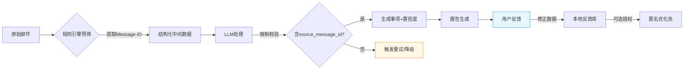

# mailCopilot 产品需求文档（PRD）  
**版本**：V1.0 
**日期**：2026年1月28日  
**核心升级**：事项可溯源 · 准确性可验证 · 用户可校正  

---

## 一、产品概述（更新）
### 1.1 产品目标（新增准确性指标）
> **核心价值**：让用户完全掌控邮件处理逻辑，在保障隐私的前提下，将邮件高效转化为**可验证、可溯源**的结构化事项清单  
> **成功指标**（V1.0 MVP）：  
> - ✅ 首次配置完成率 ≥85%  
> - ✅ **事项可溯源率 100%**（每个事项含完整邮件索引）  
> - ✅ **用户对事项准确性的满意度 ≥4.2/5.0**（调研）  
> - ✅ **低置信度事项复核提示覆盖率 100%**  
> - ✅ 日均活跃用户留存率（7日）≥70%  

### 1.2 准确性设计原则
| 原则 | 说明 | 用户价值 |  
|------|------|----------|  
| **可溯源** | 每个事项绑定原始邮件唯一标识（Message-ID） | 用户可秒级定位原始上下文，消除“凭空生成”疑虑 |  
| **可验证** | 报告内嵌邮件关键元数据（发件人/时间/主题片段） | 无需切换窗口即可交叉验证事项真实性 |  
| **可校正** | 提供轻量反馈入口，用户修正即优化系统认知 | 用户成为准确性共建者，越用越准 |  
| **可感知** | 置信度可视化 + 低置信度主动提示 | 用户清晰掌握哪些事项需重点关注 |  

---

## 二、用户场景与故事（新增准确性场景）
### 2.1 关键用户故事（新增P0级）
| 优先级 | 用户故事 | 验收标准 |  
|--------|----------|----------|  
| **P0** | 作为用户，我需要每个事项都能**精准追溯到原始邮件**，以便验证内容真实性 | 1. 报告中每个事项显示：发件人、日期、主题关键词、Message-ID2. 点击“查看原文”可定位至邮件客户端（支持Thunderbird/Mail.app）3. 100%事项含有效邮件索引，无“来源不明”事项 |  
| **P0** | 作为严谨用户，我需要系统**主动提示低置信度事项**，避免遗漏关键错误 | 1. 置信度<0.6的事项自动标注"[需复核]"2. 报告顶部汇总提示“发现3条需复核事项”3. 低置信度事项高亮显示（浅黄色背景） |  
| **P1** | 作为用户，我希望**轻松反馈事项错误**，帮助系统持续优化 | 1. 每个事项旁有"✓/✗"反馈按钮2. 点击"✗"弹出简短原因选项（“内容错误”“优先级错误”“非事项”）3. 反馈数据本地加密存储，用户可导出或清除 |  

---

## 三、功能需求详述（准确性专项增强）
### 3.1 事项溯源与索引模块（新增）
| 需求ID | 需求描述 | 用户价值 |  
|--------|----------|----------|  
| **TRACE-01** | **邮件唯一标识绑定**：解析邮件时提取Message-ID（RFC 5322标准），作为事项核心索引 | 消除邮件重复/混淆风险，精准定位源头 |  
| **TRACE-02** | **报告内嵌溯源信息**：每个事项下方显示：`📧 来源：张三 <zhang@example.com> | 2026-01-27 14:30 | [项目A]进度确认` | 无需离开报告即可验证上下文 |  
| **TRACE-03** | **一键定位原文**：- Windows/macOS：生成邮件客户端深度链接（如`thunderbird://message?id=xxx`）- 通用方案：高亮显示邮件存储路径+偏移量 | 极致验证体验，3秒内回到原始邮件 |  
| **TRACE-04** | **索引完整性校验**：处理流程中校验Message-ID缺失，缺失时标记"[索引异常]"并记录日志 | 防御性设计，避免静默错误 |  

### 3.2 准确性保障模块（新增）
| 需求ID | 需求描述 | 用户价值 |  
|--------|----------|----------|  
| **ACC-01** | **双引擎置信度计算**：- 规则匹配度（0-1）：关键词覆盖密度+规则权重- LLM置信度（0-1）：模型输出概率（云端）/ 一致性校验（本地）- 综合置信度 = (规则×0.3 + LLM×0.7) | 科学量化准确性，非主观判断 |  
| **ACC-02** | **动态阈值提示**：- 置信度≥0.8：正常显示- 0.6≤置信度<0.8：灰色小字标注"[建议复核]"- 置信度<0.6：高亮+顶部汇总提示 | 用户注意力精准分配 |  
| **ACC-03** | **结构化输出校验**：LLM响应必须含`source_message_id`字段，缺失则触发重试或降级至规则引擎 | 从流程上保障数据完整性 |  
| **ACC-04** | **用户反馈闭环**：- 反馈数据本地存储于`feedback.db`（SQLite）- 设置页提供“反馈统计”（如“本月修正5处错误”）- **可选**：用户授权后匿名上传至优化库（需明确勾选） | 用户掌控数据，同时赋能系统进化 |  

### 3.3 报告生成模块（增强）
| 需求ID | 原需求 | 增强内容 |  
|--------|--------|----------|  
| **REPORT-01** | 生成Markdown报告 | **新增**：- 每个事项区块含溯源信息+置信度标签- 报告页脚添加“数据溯源说明”：  `ℹ️ 所有事项均可追溯至原始邮件。点击事项旁[原文]按钮快速定位` |  
| **REPORT-05** | （新增）报告顶部摘要 | 显示：`✅ 高置信度事项：12条 | ⚠️ 需复核事项：2条（点击查看）` |  
| **REPORT-06** | （新增）反馈入口 | 每个事项右上角显示微型反馈按钮（✓/✗），悬停提示“标记准确/错误” |  

---

## 四、非功能需求（新增准确性维度）
| 类别 | 需求描述 | 验收标准 |  
|------|----------|----------|  
| **准确性** | 事项识别质量 | - 内部测试集F1值 ≥0.85- **100%事项含有效邮件索引**- 用户调研“事项可验证性”评分 ≥4.3/5.0 |  
| **可追溯性** | 溯源链路完整性 | - Message-ID提取成功率 ≥99%（标准邮件）- 深度链接在主流客户端打开成功率 ≥95% |  
| **用户信任** | 准确性感知 | - 90%用户能准确描述“如何验证事项来源”- 低置信度提示被用户主动查看率 ≥70% |  
| **性能** | 索引处理开销 | 邮件解析阶段Message-ID提取耗时 ≤50ms/封（i5设备） |  

---

## 五、准确性保障设计（产品方案核心）
### 5.1 三重准确性防线


### 5.2 关键设计说明
| 设计点 | 实现逻辑 | 用户感知 |  
|--------|----------|----------|  
| **索引前置绑定** | 邮件解析阶段即提取Message-ID，贯穿全流程 | 报告中每个事项自带“身份证” |  
| **置信度透明化** | 综合规则+LLM计算，非黑盒分数 | 事项旁显示“高/中/低”或进度条 |  
| **防御性校验** | LLM输出缺失关键字段时自动降级 | 避免生成“无来源”事项，宁缺毋滥 |  
| **反馈轻量化** | 单按钮反馈（✓/✗），3秒内完成 | 降低反馈门槛，提升数据收集率 |  
| **用户控制权** | 反馈数据本地存储，上传需二次授权 | 消除“被监控”顾虑，建立信任 |  

### 5.3 用户验证路径示例
```plaintext
用户看到报告事项：
  [高优] 完成Q3预算审批（需复核）
  📧 来源：王总监 <wang@company.com> | 2026-01-27 09:15 | [财务]Q3预算终版
  [原文] [✓] [✗]

用户操作：
  1. 点击"[原文]" → 自动跳转至Thunderbird中该邮件
  2. 发现事项描述有误 → 点击"[✗]" → 选择“内容错误”
  3. 系统提示：“已记录反馈，后续将优化识别逻辑”
  4. （可选）设置页开启“匿名贡献优化数据” → 帮助社区提升准确性
```

---

## 六、验收标准（新增准确性专项）
| 维度 | 标准 | 验证方式 |  
|------|------|----------|  
| **溯源完整性** | 100%生成事项含有效Message-ID及关键元数据 | 自动化脚本扫描100份测试报告 |  
| **置信度有效性** | 低置信度事项（<0.6）中，用户复核确认错误率 ≥60% | 用户测试+反馈数据分析 |  
| **用户验证效率** | 90%用户能在10秒内完成单事项溯源验证 | 用户测试计时 |  
| **反馈闭环** | 反馈入口点击率 ≥30%（活跃用户） | 匿名使用统计（需用户授权） |  
| **信任提升** | 用户调研“我信任事项来源”的认同度 ≥85% | 5分制问卷（4-5分占比） |  

---

## 七、发布范围（V1.0 MVP）
### 7.1 必做功能（准确性核心）
- [x] **邮件索引绑定**：Message-ID提取+全流程传递  
- [x] **报告溯源信息**：每个事项显示发件人/时间/主题/Message-ID  
- [x] **深度链接定位**：支持Thunderbird/Mail.app一键跳转  
- [x] **置信度计算与提示**：双引擎评分+可视化标注  
- [x] **轻量反馈入口**：✓/✗按钮+原因选项+本地存储  
- [x] **低置信度汇总提示**：报告顶部醒目提示  

### 7.2 未来迭代
- [ ] 反馈数据驱动规则优化（V2.2）  
- [ ] 多邮件客户端深度链接支持（Outlook等）  
- [ ] 事项修正建议（用户标记错误后，系统推荐修正内容）  

---

## 八、附录
### 附录A：邮件索引规范
| 字段 | 来源 | 用途 | 用户可见性 |  
|------|------|------|------------|  
| **Message-ID** | 邮件头（RFC 5322） | 唯一标识，深度链接锚点 | 报告中显示（可折叠） |  
| **发件人** | 邮件头 | 事项来源标识 | 报告中高亮显示 |  
| **日期时间** | 邮件头 | 事项时效性判断 | 报告中显示 |  
| **主题关键词** | 主题行截取 | 快速识别邮件主题 | 报告中显示 |  
| **存储路径+偏移** | 本地文件系统 | 通用定位方案 | 仅深度链接失效时显示 |  

### 附录B：置信度计算逻辑（简化版）
```plaintext
综合置信度 = 
  (规则匹配度 × 0.3) + 
  (LLM输出置信度 × 0.7)

规则匹配度 = 
  关键词覆盖密度(0-1) × 规则权重 + 
  语义模式匹配得分(0-1)

LLM置信度 = 
  云端：模型返回的logprob（如OpenAI的logprobs） 
  本地：一致性校验（多次采样结果一致性）
```

### 附录C：用户反馈数据流
```plaintext
用户点击[✗] 
  → 本地加密存储至 feedback.db（含：事项ID、反馈类型、时间戳） 
  → 系统提示“已记录” 
  → （用户授权后）匿名哈希上传至优化池（不含邮件内容）
```

---

> **准确性设计承诺**  
> 🔍 **不生成无法验证的事项**——每个结论都有据可查  
> 🌱 **用户是准确性共建者**——你的反馈让系统更懂你  
> 🛡️ **透明优于完美**——明确标注不确定性，而非隐藏错误  
>  
> **“我们不追求100%的机器准确，但保证100%的人类可验证”**  
>  
> *文档结束 | 个人项目 · 用户主权 · 隐私优先 · 准确可溯*  
> *© 2026 MailDigest Agent | 用心设计 · 持续进化*