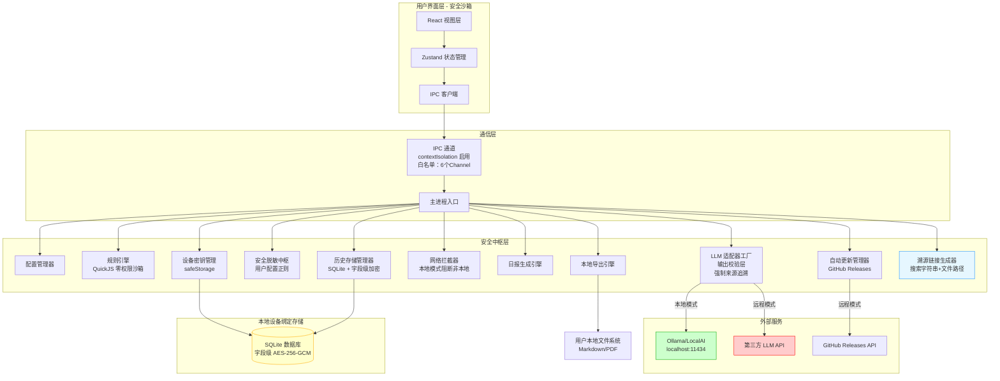

**mailCopilot 技术设计文档**
**版本**：v2.7
**日期**：2026年2月5日

**修订说明**：
- 补充前端技术栈`TailWindCSS` `shadcn-ui` `Lucide-React` `Inter`
- 修正低置信度事项处理逻辑：由直接丢弃改为降级入库（标记"[来源待确认]"）
- 扩展数据保留期支持：新增 `-1`（永久保留）选项
- 优化模式切换机制：由重启生效改为等待当前批次完成后热切换
- 统一置信度计算权重：规则引擎 50% + LLM 50%，失败时调整权重
- 简化反馈存储：移除独立 feedback.db，集成至 `todo_items` 表
- 明确溯源实现：基于搜索字符串 + 文件路径，移除深度链接
- 补充邮件格式解析库具体选型（msg-extractor/libpff）

---

## 1. 项目概述

mailCopilot 是一款面向隐私敏感场景的本地邮件智能处理客户端，通过规则引擎与本地/远程 LLM 协同，在**用户可控环境**下实现邮件内容结构化、事项提取、**自动生成与留存用户日报**（包含完成事项、待办事项、当日情况总结）。

**核心原则**：
- **默认远程模式**：首次启动默认使用远程模式（去标识化数据传输至第三方 LLM 服务商）
- **完全离线可选**：用户可自行部署 Ollama/LocalAI 等本地服务并切换至"本地模式"
- **单设备绑定**：所有历史日报与配置**严格绑定当前设备**，不跨设备同步，**无密码机制，重装系统或更换设备即数据丢失**
- **防幻觉机制**：所有提取事项**必须关联具体邮件来源**，无来源事项**降级入库并明确标注**"[来源待确认]"，置信度强制≤0.4，禁止静默丢弃
- **数据最小化**：原始邮件正文处理完成后立即清理，仅保留元数据（90 天，可配置为永久）用于溯源
- **功能极简**：专注邮件事项提取、日报生成与本地历史查询，**无需用户记忆任何密码**

---

## 2. 设计目标与运行模式

### 2.1 运行模式定义

| 模式 | 行为 | 适用场景 | 降级策略 |
|------|------|----------|----------|
| **远程模式** | 去标识化数据经 TLS 1.3 传输至第三方 LLM 服务 | 无本地算力、追求处理效率 | 无降级路径，LLM 失效时仅提示错误 |
| **本地模式** | 所有处理在设备完成，网络层物理阻断非本地请求 | 高合规场景（金融/政务/医疗） | 连接失败时阻断功能，**禁止自动降级** |

**模式切换规则**：
- 模式切换在设置页操作，**等待当前处理批次完成后自动生效**，无需重启应用
- 切换期间新任务进入队列，当前批次处理完毕后应用新模式
- 本地模式下**禁用自动更新检查**，需用户手动触发；远程模式下启动时自动检查更新

### 2.2 数据生命周期与存储边界

- **原始邮件正文**：处理完成后**立即清理**，**不保留原始邮件内容**
- **邮件元数据**：发件人哈希、主题（脱敏后）、时间、附件列表保留 **90 天**（可配置，支持永久保留 `-1`），用于来源追溯
- **日报历史**：**本地设备绑定存储**（字段级加密），支持按日期查询，**无跨设备恢复能力**
- **数据丢失场景**：重装系统、更换电脑、卸载应用并清除数据目录时，历史日报**永久丢失**（设计预期）
- **本地导出**：支持导出当日或历史日报文件（Markdown/PDF），导出文件**明文不加密**，用户自行保管

---

## 3. 技术架构

### 3.1 整体架构图



### 3.2 技术栈明细

| 组件 | 技术选型 | 核心作用 | 安全特性 |
|------|----------|----------|----------|
| **跨平台框架** | Electron 29.4.6 | 主进程+渲染进程隔离 | sandbox 启用，contextIsolation 强制，单实例锁 |
| **前端框架** | React 18 + TypeScript 5.4 | 用户界面与交互 | 错误边界隔离，Zod 运行时校验 |
| **UI 组件** | Tailwind CSS v3.4 + shadcn/ui | 高可定制、可访问性强的组件 | 无运行时依赖，纯 CSS + React，可完全自托管 |
| **图标系统、字体** | Lucide React + Inter (variable font) | 用轻量、现代、开源图标集，现代无衬线字体 | Tree-shaking 支持，按需导入 |
| **状态管理** | Zustand 4.5 | 跨组件状态共享 | 敏感状态内存加密，页面卸载清零 |
| **本地数据库** | better-sqlite3 11.10.0 | 历史日报与事项存储 | **字段级 AES-256-GCM 加密**，WAL 模式 |
| **配置系统** | JSON Schema + Ajv | 配置验证 | HMAC-SHA256 签名防篡改 |
| **密钥管理** | Electron safeStorage API | 自动管理设备密钥 | 随机生成密钥，系统密钥环托管，**无需用户输入** |
| **规则执行** | QuickJS (WASM) | 规则脚本沙箱 | 零权限沙箱，内存 128MB 限制，5秒超时 |
| **LLM 输出校验** | Zod Schema | 结构化输出验证 | 缺失字段自动重试（最多2次），失败降级入库（标记来源待确认） |
| **邮件接入** | imapflow + mailparser | IMAP/POP3/本地文件 | TLS 1.3 强制，20MB 大小限制 |
| **格式扩展** | msg-extractor / libpff / readpst | Outlook MSG/PST解析 | 本地库解析，不上传云端 |
| **导出引擎** | 内置模板引擎 + puppeteer | Markdown/PDF 生成 | 明文导出，导出前安全提示 |
| **自动更新** | electron-updater | 检查 GitHub Releases | 强制代码签名验证，本地模式需手动触发 |

---

## 4. 核心模块设计

### 4.1 配置管理器

负责应用配置的加载、验证、热重载与防篡改保护。配置经 safeStorage 加密存储于本地，**绑定当前设备**。

**关键配置项**：
- `llm.mode`: `'local' | 'remote'`（切换后待当前批次完成生效）
- `llm.localEndpoint`: 默认 `localhost:11434`
- `storage.retentionDays`: 默认 90 天（30/90/180/365/-1，-1代表永久）
- `desensitization.rules`: 用户可启用/禁用/排序默认规则，**不可编辑正则**
- `update.autoCheck`: 远程模式默认 true，本地模式强制 false

### 4.2 规则引擎

基于 QuickJS WASM 沙箱的规则执行环境。

**安全约束**：
- 禁用 `os`、`std`、`eval`、`Function`
- 内存限制 128MB，执行时间 5 秒，递归深度 100 层

### 4.3 LLM 适配层与输出校验层

**防幻觉机制 - 强制来源追溯与降级入库**：

1. **Prompt 强制约束**：要求模型必须输出 `source_email_indices`（邮件批次中的序号数组）、`evidence`（提取依据）、`confidence`（0-100）

2. **Zod Schema 校验**（修订）：
   ```typescript
   const ItemSchema = z.object({
     content: z.string(),
     type: z.enum(['completed', 'pending']),
     source_email_indices: z.array(z.number()).optional(), // 改为可选，支持降级
     evidence: z.string(),
     confidence: z.number().min(0).max(100),
     source_status: z.enum(['verified', 'unverified']).default('verified'), // 新增
     feedback_type: z.enum(['content_error', 'priority_error', 'not_actionable', 'source_error']).optional() // 新增
   });
   ```

3. **索引有效性验证**：校验 `source_email_indices` 均在当前批次范围内

4. **处理策略**：
   - 高置信度（≥0.8）：正常入库，`source_status='verified'`
   - 中置信度（0.6-0.79）：入库标记`[建议复核]`，`source_status='verified'`
   - 低置信度（<0.6）：入库高亮，`source_status='verified'`
   - **无来源或校验失败**：**不丢弃**，入库 `source_status='unverified'`，`confidence`强制≤0.4，标注"[来源待确认]"

5. **置信度计算**：
   ```typescript
   function calculateConfidence(ruleMatchScore: number, llmOutput: any, isLocalMode: boolean): number {
     const ruleWeight = 0.5;
     const llmWeight = 0.5;
     
     let llmScore: number;
     if (isLocalMode) {
       // Schema完整性（70%）+ 关键字匹配（30%）
       const schemaValid = validateJsonSchema(llmOutput) ? 1.0 : 0.0;
       const keywordMatch = checkKeywordCoherence(llmOutput, emailBody);
       llmScore = (schemaValid * 0.7) + (keywordMatch * 0.3);
     } else {
       llmScore = llmOutput.confidence / 100;
     }
     
     let confidence = ruleMatchScore * ruleWeight + llmScore * llmWeight;
     
     // Schema校验失败调整：规则60% + LLM 20%（LLM折半），上限0.6
     if (!validateJsonSchema(llmOutput)) {
       confidence = ruleMatchScore * 0.6 + (llmScore * 0.5) * 0.4;
       confidence = Math.min(confidence, 0.6);
     }
     
     return Math.round(confidence * 100) / 100;
   }
   ```

### 4.4 溯源链接生成器

负责生成用户用于在邮件客户端中定位原文的搜索字符串。

```typescript
interface EmailTraceability {
  searchString: string; // 格式：from:<email> subject:<subject> date:<YYYY-MM-DD>
  filePath: string;     // 绝对路径
}

function generateTraceability(email: ParsedEmail): EmailTraceability {
  const dateStr = email.date.toISOString().split('T')[0];
  const subjectSnippet = email.subject.substring(0, 30).replace(/"/g, '\\"');
  
  return {
    searchString: `from:${email.from} subject:"${subjectSnippet}" date:${dateStr}`,
    filePath: email.filePath
  };
}
```

**说明**：不提供深度链接（`message://`或`thunderbird://`），用户需复制`searchString`至邮件客户端手动搜索。

### 4.5 历史存储管理器与数据模型

#### 4.5.1 设备绑定存储机制

- **密钥生成**：首次启动时自动生成随机 256 位密钥，经 **safeStorage** 存入系统密钥环
- **字段级加密**：敏感字段（`content_encrypted`, `config_value`）应用 AES-256-GCM，数据库文件本身不加密
- **数据迁移限制**：密钥绑定系统账户与设备硬件环境，**更换设备或重装系统后密钥不可恢复**
- **存储周期**：默认保留 **90 天**（可配置 30/90/180/365/-1 天，-1为永久保留），超期自动清理（保留期-1时跳过清理）

#### 4.5.2 数据库 Schema

```sql
-- 元数据表
CREATE TABLE app_metadata (
    key TEXT PRIMARY KEY CHECK(key IN ('schema_version', 'install_time', 'device_fingerprint')),
    value TEXT NOT NULL,
    updated_at INTEGER NOT NULL DEFAULT (strftime('%s', 'now'))
);

-- 用户配置表（加密存储）
CREATE TABLE user_config (
    config_key TEXT PRIMARY KEY,
    config_value BLOB NOT NULL, -- AES-256-GCM 加密
    updated_at INTEGER NOT NULL DEFAULT (strftime('%s', 'now'))
);

-- 日报主表
CREATE TABLE daily_reports (
    report_date TEXT PRIMARY KEY CHECK(report_date LIKE '____-__-__'),
    created_at INTEGER NOT NULL DEFAULT (strftime('%s', 'now')),
    updated_at INTEGER NOT NULL DEFAULT (strftime('%s', 'now')),
    generation_mode TEXT NOT NULL CHECK(generation_mode IN ('local', 'remote')),
    completed_count INTEGER NOT NULL DEFAULT 0 CHECK(completed_count >= 0),
    pending_count INTEGER NOT NULL DEFAULT 0 CHECK(pending_count >= 0),
    content_encrypted BLOB NOT NULL, -- JSON: {completed_items[], pending_items[], summary}
    content_checksum TEXT NOT NULL, -- SHA-256 防篡改
    source_email_hashes TEXT NOT NULL DEFAULT '[]' -- JSON 数组
) STRICT;

CREATE INDEX idx_reports_created ON daily_reports(created_at DESC);

-- 事项明细表（修订：增加source_status和feedback_type）
CREATE TABLE todo_items (
    item_id TEXT PRIMARY KEY,
    report_date TEXT NOT NULL REFERENCES daily_reports(report_date),
    content_encrypted BLOB NOT NULL,
    content_checksum TEXT NOT NULL,
    item_type TEXT NOT NULL CHECK(item_type IN ('completed', 'pending')),
    tags TEXT NOT NULL DEFAULT '[]' CHECK(json_array_length(tags) IS NOT NULL),
    created_at INTEGER NOT NULL DEFAULT (strftime('%s', 'now')),
    is_manually_edited INTEGER NOT NULL DEFAULT 0 CHECK(is_manually_edited IN (0, 1)),
    source_status TEXT NOT NULL DEFAULT 'verified' CHECK(source_status IN ('verified', 'unverified')), -- 新增：verified/unverified
    confidence_score REAL CHECK(confidence_score >= 0 AND confidence_score <= 1), -- 新增：置信度存储
    feedback_type TEXT CHECK(feedback_type IN ('content_error', 'priority_error', 'not_actionable', 'source_error')) -- 新增：反馈类型，可为空
) STRICT;

CREATE INDEX idx_items_report_date ON todo_items(report_date);
CREATE INDEX idx_items_type ON todo_items(item_type);
CREATE INDEX idx_items_source_status ON todo_items(source_status); -- 新增索引

-- 事项-邮件关联表（多对多，防幻觉核心）
CREATE TABLE item_email_refs (
    ref_id TEXT PRIMARY KEY,
    item_id TEXT NOT NULL REFERENCES todo_items(item_id) ON DELETE CASCADE,
    email_hash TEXT NOT NULL REFERENCES processed_emails(email_hash),
    evidence_text TEXT NOT NULL, -- 模型提取理由（脱敏后）
    confidence INTEGER CHECK(confidence >= 0 AND confidence <= 100),
    created_at INTEGER NOT NULL DEFAULT (strftime('%s', 'now'))
) STRICT;

CREATE INDEX idx_refs_item ON item_email_refs(item_id);
CREATE INDEX idx_refs_email ON item_email_refs(email_hash);

-- 邮件处理记录表（仅元数据，不存内容）
CREATE TABLE processed_emails (
    email_hash TEXT PRIMARY KEY, -- SHA-256(Message-ID + Date + From)
    processed_at INTEGER NOT NULL DEFAULT (strftime('%s', 'now')),
    report_date TEXT REFERENCES daily_reports(report_date),
    attachments_meta TEXT NOT NULL DEFAULT '[]', -- 仅记录文件名/大小/MIME
    extract_status TEXT NOT NULL CHECK(extract_status IN ('success', 'no_content', 'error')),
    error_log TEXT,
    search_string TEXT, -- 新增：生成的搜索字符串，用于溯源
    file_path TEXT -- 新增：原始文件路径
) STRICT;

CREATE INDEX idx_emails_report ON processed_emails(report_date);

-- 应用日志表（仅问题排查）
CREATE TABLE app_logs (
    log_id INTEGER PRIMARY KEY AUTOINCREMENT,
    level TEXT NOT NULL CHECK(level IN ('DEBUG', 'INFO', 'WARN', 'ERROR')),
    module TEXT NOT NULL,
    message TEXT NOT NULL,
    timestamp INTEGER NOT NULL DEFAULT (strftime('%s', 'now') * 1000),
    context_id TEXT,
    stack_trace TEXT
) STRICT;

CREATE INDEX idx_logs_timestamp ON app_logs(timestamp DESC);

-- 触发器：自动维护统计字段
CREATE TRIGGER trg_update_report_stats_insert 
AFTER INSERT ON todo_items
BEGIN
    UPDATE daily_reports 
    SET updated_at = strftime('%s', 'now'),
        completed_count = CASE WHEN NEW.item_type = 'completed' 
            THEN completed_count + 1 ELSE completed_count END,
        pending_count = CASE WHEN NEW.item_type = 'pending' 
            THEN pending_count + 1 ELSE pending_count END
    WHERE report_date = NEW.report_date;
END;
```

### 4.6 模式切换管理器

管理本地/远程模式的热切换，确保当前批次完成后再应用新模式。

```typescript
class ModeSwitchManager {
  private pendingMode: 'local' | 'remote' | null = null;
  private isProcessingBatch = false;

  async requestModeSwitch(newMode: 'local' | 'remote') {
    if (this.isProcessingBatch) {
      this.pendingMode = newMode;
      return { status: 'queued', message: '当前批次处理完成后将切换模式' };
    } else {
      return this.executeSwitch(newMode);
    }
  }

  setProcessingState(processing: boolean) {
    this.isProcessingBatch = processing;
    if (!processing && this.pendingMode) {
      this.executeSwitch(this.pendingMode);
      this.pendingMode = null;
    }
  }

  private async executeSwitch(mode: 'local' | 'remote') {
    // 应用新模式，更新配置，重启网络拦截器等
    config.set('llm.mode', mode);
    await networkInterceptor.applyMode(mode);
    return { status: 'completed', message: '模式已切换' };
  }
}
```

### 4.7 单实例锁机制

**禁止应用多开**，防止 SQLite 并发写入损坏。

```typescript
const gotTheLock = app.requestSingleInstanceLock();
if (!gotTheLock) {
  app.quit();
} else {
  app.on('second-instance', () => {
    const mainWindow = BrowserWindow.getAllWindows()[0];
    if (mainWindow) {
      if (mainWindow.isMinimized()) mainWindow.restore();
      mainWindow.focus();
      dialog.showMessageBox(mainWindow, {
        type: 'info',
        title: 'mailCopilot',
        message: '应用已在运行中',
        detail: 'mailCopilot 仅允许单实例运行，已为您聚焦到现有窗口。'
      });
    }
  });
}
```

### 4.8 本地导出引擎

- **导出格式**：Markdown（默认）、PDF
- **安全提示**：导出前强制弹窗："导出的文件未加密，请妥善保管"
- **内容范围**：单日/日期范围/全部，包含事项来源邮件索引但不包含原始邮件内容

### 4.9 自动更新管理器（GitHub Releases）

- **更新源**：GitHub Releases 公开仓库托管更新包
- **远程模式**：启动时自动检查更新，下载完成后托盘提示"重启安装"，**不强制重启**
- **本地模式**：完全禁用自动检查，设置页提供手动检查按钮
- **安全验证**：强制验证代码签名（Windows Authenticode / macOS Developer ID），哈希校验失败则拒装
- **网络异常**：静默失败，状态栏显示"无法检查更新"，不阻断核心功能

---

## 5. 技术规范

### 5.1 进程隔离与通信

- **IPC 白名单**（仅 6 个 Channel）：
  `llm:generate`, `db:query:history`, `db:export`, `config:get/set`, `app:check-update`, `email:fetch-meta`
- **数据校验**：所有 IPC 入参使用 Zod 运行时校验
- **CSP 策略**：`default-src 'self'; script-src 'self'; connect-src 'self' https://api.github.com`（远程模式）或 `'self'`（本地模式）

### 5.2 数据安全策略

| 场景 | 策略 | 用户影响 |
|------|------|----------|
| **应用卸载** | 保留数据目录（`~/.mailcopilot/`），重装后可恢复 | 同设备重装可恢复历史 |
| **系统重装** | 系统密钥环重置，密钥丢失，数据不可解密 | **历史数据永久丢失**（设计预期） |
| **更换设备** | 密钥绑定原设备，新设备无法读取旧数据库 | **历史数据永久丢失**（设计预期） |
| **导出文件** | 明文生成，用户自行保管 | 导出后文件安全性由用户负责 |
| **邮件处理** | 正文立即清理，元数据保留 90 天（可配置永久） | 90天内（或永久）可溯源，超期（若非永久）仅保留日报 |

### 5.3 错误处理

| 错误场景 | 处理策略 | 用户提示 |
|----------|----------|----------|
| **数据库密钥读取失败** | 判定为设备环境变更，提示数据不可恢复 | "检测到设备环境变更，无法访问历史数据。如已更换设备或重装系统，历史数据已丢失。" |
| **本地 LLM 连接失败** | 功能阻断，禁止自动降级 | "本地模型服务不可用，请检查 Ollama 是否运行在 localhost:11434" |
| **LLM 输出校验失败** | 不重试直接降级入库，标记`source_status='unverified'`，`confidence`≤0.4 | 事项标注"[来源待确认]" |
| **单实例冲突** | 聚焦已存在窗口 | "应用已在运行中" |
| **模式切换请求** | 等待当前批次完成，切换新模式 | "当前任务处理完成后将切换模式" |

### 5.4 性能与资源限制

- **邮件处理**：单封 20MB 限制，正文 10 万字符截断，每批最多 50 封
- **邮件格式解析**：.pst/.ost 格式额外耗时约 +200ms/封
- **数据库**：启用 WAL 模式，`synchronous = NORMAL`，所有写入通过事务包裹
- **内存管理**：敏感数据使用后立即 `Buffer.fill(0)` 清零
- **并发控制**：LLM 请求并发限制 3（远程）/ 1（本地）

---

## 6. 用户体验

### 6.1 首次启动引导

1. **模式选择**：双模式卡片展示（本地/远程），默认远程
2. **隐私确认**：披露远程模式数据传输范围，本地模式提示需自行部署 Ollama
3. **自动初始化**：无需设置密码，进入主界面即自动初始化设备绑定数据库

### 6.2 主界面与日报中心

- **今日日报**：展示当日事项，每个事项显示"来源"图标（关联 N 封邮件），点击可查看邮件元数据（发件人域、时间、附件列表）及**复制搜索关键词**按钮
- **置信度标识**：低置信度（<0.6）或`source_status='unverified'`显示"[来源待确认]"标记，hover 提示"建议核对"
- **历史视图**：时间轴展示，支持搜索与筛选，点击日期跳转详情
- **导出功能**：一键导出 Markdown/PDF，导出前强制安全提示

### 6.3 数据管理

- **存储信息**：显示本地数据占用大小与保留期限（支持显示"永久"）
- **清理数据**：提供"清理 30 天前数据"或"清空所有历史"选项，二次确认
- **更换设备警告**：设置页显著位置提示"当前数据仅限本机存储，更换设备将丢失所有历史"
- **反馈统计**：设置页显示"本月修正 X 处错误"（基于`feedback_type`统计）

### 6.4 合规与风险提示

- **数据主权**：所有数据留存于用户本地设备，**不提供云端备份、跨设备同步或密码恢复机制**
- **数据丢失风险**：明确告知用户"重装系统或更换设备将导致历史日报永久丢失，如需保留请提前导出文件"

---

## 7. 测试体系与质量保障

### 7.1 测试策略

**测试金字塔**（无 E2E）：
- **单元测试**（60%）：工具函数、安全算法、纯函数逻辑
- **集成测试**（40%）：数据库操作、IPC 通信、LLM 适配器、进程锁机制

**覆盖率标准**：
- 单元测试：行覆盖率 ≥ 85%，分支覆盖率 ≥ 80%
- 安全关键模块（加密、校验、脱敏、沙箱）：**100% 分支覆盖**

### 7.2 核心测试方案

#### 7.2.1 LLM 输出校验层（防幻觉与降级）

验证无 `source_email_indices` 时降级入库而非丢弃。

```typescript
describe('LLM 输出校验层', () => {
  it('应降级入库无 source_email_indices 的事项（标记unverified）', async () => {
    const maliciousOutput = { items: [{ content: "完成项目", source_email_indices: [] }] };
    const result = await validator.validate(maliciousOutput);
    expect(result.items[0].source_status).toBe('unverified');
    expect(result.items[0].confidence).toBeLessThanOrEqual(0.4);
  });

  it('应拒绝索引越界的事项（标记unverified）', async () => {
    const fakeOutput = { items: [{ content: "虚假事项", source_email_indices: [5] }] };
    const result = await validator.validate(fakeOutput);
    expect(result.items[0].source_status).toBe('unverified');
  });

  it('应接受多对多邮件关联（标记verified）', async () => {
    const validOutput = { items: [{ content: "确认会议", source_email_indices: [1, 2] }] };
    const result = await validator.validate(validOutput);
    expect(result.items[0].source_status).toBe('verified');
  });
});
```

#### 7.2.2 字段级加密与设备绑定

验证敏感数据不落盘明文，密钥错误时无法解密。

```typescript
describe('字段级加密', () => {
  it('写入的敏感数据应为加密字节流', () => {
    const sensitive = JSON.stringify({ summary: "机密内容" });
    const encrypted = encryption.encrypt(sensitive);
    expect(encrypted.toString()).not.toContain("机密内容");
  });

  it('使用错误密钥应解密失败（模拟设备变更）', () => {
    const wrongKey = Buffer.from('b'.repeat(32));
    expect(() => {
      FieldEncryption.decryptWithKey(encryptedData, wrongKey);
    }).toThrow('Unable to authenticate');
  });
});
```

#### 7.2.3 模式切换队列（新增）

```typescript
describe('模式切换管理器', () => {
  it('应在当前批次完成后切换模式', async () => {
    const manager = new ModeSwitchManager();
    manager.setProcessingState(true);
    
    const promise = manager.requestModeSwitch('local');
    expect((await promise).status).toBe('queued');
    
    manager.setProcessingState(false); // 模拟批次完成
    // 验证模式已切换
  });
});
```

#### 7.2.4 QuickJS 沙箱安全边界

验证沙箱无法访问文件系统、网络，且资源限制生效。

```typescript
describe('QuickJS 沙箱', () => {
  it('应阻止访问文件系统', async () => {
    await expect(runtime.execute('require("fs").readFileSync("/etc/passwd")'))
      .rejects.toThrow(/require is not defined/);
  });

  it('应限制内存使用（128MB上限）', async () => {
    const bomb = 'const arr=[]; while(true) arr.push("x".repeat(1024*1024));';
    await expect(runtime.execute(bomb)).rejects.toThrow(/out of memory/);
  });

  it('应限制执行时间（5秒超时）', async () => {
    await expect(runtime.execute('while(true){}')).rejects.toThrow(/timed out/);
  });
});
```

#### 7.2.5 单实例锁并发测试（集成）

```typescript
describe('单实例锁', () => {
  it('第二个实例应获取锁失败并退出', () => {
    const first = createMockApp();
    expect(first.requestSingleInstanceLock()).toBe(true);
    
    const second = createMockApp();
    expect(second.requestSingleInstanceLock()).toBe(false);
    expect(second.quitCalled).toBe(true);
  });
});
```

#### 7.2.6 多对多关联关系（数据完整性）

```typescript
describe('事项-邮件关联', () => {
  it('应支持单个事项关联多封邮件', () => {
    const refs = db.prepare('SELECT * FROM item_email_refs WHERE item_id=?').all('item-001');
    expect(refs).toHaveLength(3);
  });

  it('删除事项应级联删除关联记录', () => {
    db.prepare('DELETE FROM todo_items WHERE item_id=?').run('item-001');
    const remaining = db.prepare('SELECT count(*) as n FROM item_email_refs WHERE item_id=?').get('item-001');
    expect(remaining.n).toBe(0);
  });
});
```

### 7.3 CI/CD 集成

```yaml
name: Test Suite
on: [push, pull_request]

jobs:
  unit-integration:
    runs-on: ubuntu-latest
    steps:
      - uses: actions/checkout@v4
      - uses: actions/setup-node@v4
        with:
          node-version: '20'
      - run: npm ci
      - run: npm run test:unit -- --coverage
      - run: npm run test:integration
      - run: npm run test:security
      - uses: codecov/codecov-action@v3

  security-scan:
    runs-on: ubuntu-latest
    steps:
      - uses: actions/checkout@v4
      - uses: github/codeql-action/init@v3
      - run: npm ci
      - run: npm run build
      - uses: github/codeql-action/analyze@v3
```

### 7.4 关键测试交付物

- [ ] 单元测试覆盖率报告（行覆盖率 ≥ 85%，核心模块 100%）
- [ ] 集成测试报告（数据库事务、外键约束、IPC 通道验证）
- [ ] 安全测试报告（沙箱逃逸 20+ 场景测试、SQL 注入防护、内存残留检测）
- [ ] 性能基准（1000 条日报查询 < 100ms，批量解密 100 条 < 500ms）

---

## 8. 附录

### 8.1 性能指标参考

| 场景 | 硬件配置 | 处理耗时 | 内存峰值 |
|------|----------|----------|----------|
| 处理 50 封邮件生成日报 | M1 Max, Ollama 7B | ~35 秒 | ~300 MB |
| 处理 50 封邮件生成日报 | i7-12700H, OpenAI | ~18 秒 | ~200 MB |
| 查询 1 年历史日报（1000 条）| 任意 | <100 ms | ~50 MB |
| 导出 100 篇日报为 PDF | 任意 | ~15 秒 | ~100 MB |

### 8.2 数据保留与丢失策略

- **同设备重装**：若未清除系统密钥环，应用重装后可恢复数据
- **系统重装或换机**：**数据绝对丢失**，无法找回
- **邮件元数据**：默认 90 天后自动清理（可配置 30/90/180/365/-1，-1为永久保留），超期（非-1）后事项仍可显示但无法查看来源邮件详情
- **导出文件**：用户自行管理的明文文件，不受设备限制

### 8.3 邮件格式支持矩阵

| 格式 | 技术库 | 性能影响 | 备注 |
|------|--------|----------|------|
| **.eml** | mailparser | 基准 | RFC 5322标准支持 |
| **.msg** | msg-extractor | +50ms/封 | Outlook MSG格式，需提前提取 |
| **.pst/.ost** | libpff / readpst | +200ms/封 | 需先解压为中间格式，大文件额外耗时 |
| **.mbox** | mailparser + 自建分隔器 | 基准 | 基于From_分隔符解析，记录offset |
| **.html** | 正则提取 | +10ms/封 | 低支持度，仅提取基础Meta，置信度上限0.6 |

### 8.4 安全加固清单

- [ ] QuickJS 沙箱零权限验证（无文件/网络访问）
- [ ] IPC 白名单拦截测试（非白名单 Channel 拒绝）
- [ ] SQL 注入测试（所有查询参数化）
- [ ] 内存敏感数据残留检测（处理后 Buffer 清零验证）
- [ ] 单实例锁并发测试（重复启动行为验证）
- [ ] 自动更新签名验证失败测试（拒装未签名包）
- [ ] LLM 输出降级测试（无来源时标记unverified，confidence≤0.4）
- [ ] 模式切换队列测试（批次完成后切换验证）

**文档版本控制**：
- **v2.6** (当前)：对齐PRD v2.0，修正低置信度降级入库逻辑，支持永久保留（-1），优化模式切换机制，移除深度链接实现，统一置信度权重计算
- **v2.5**：引入完整测试体系；强制来源追溯防幻觉；字段级加密实现；GitHub Releases 无服务器更新
- **v2.4**：v2.3 的落地实现细化版
- **v2.3**：支持历史日报本地存储与查询
- **v2.0**：初始架构设计（已废弃）