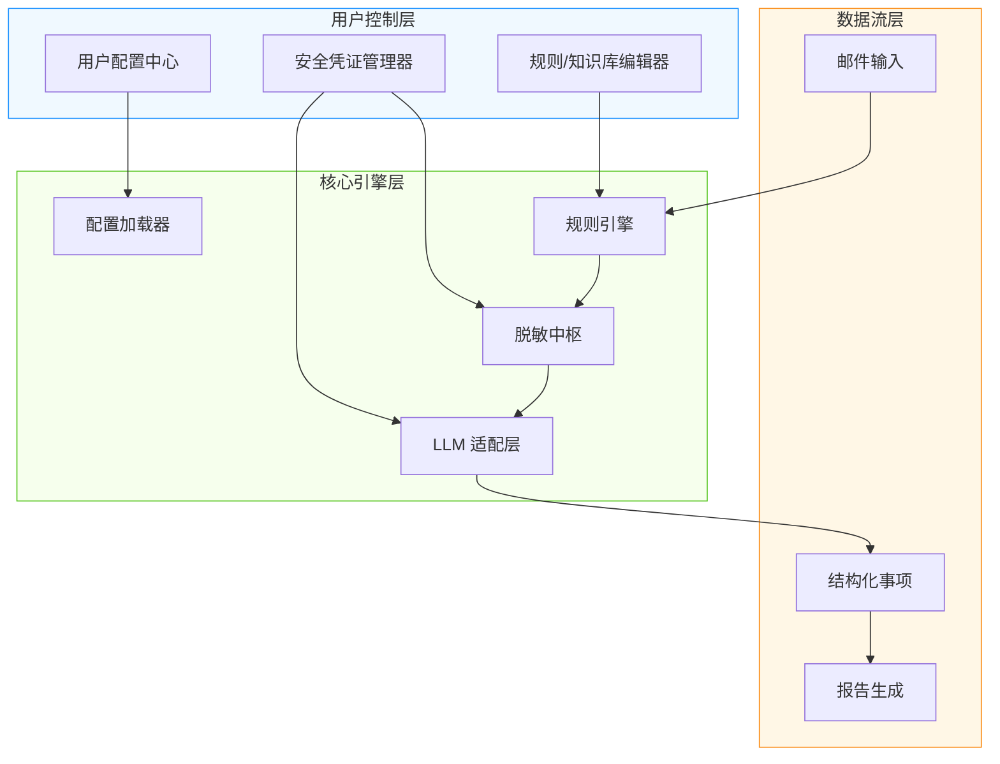

# mailCopilot 技术架构设计文档
**版本**：V1.0  
**日期**：2026年1月28日  
**核心原则**：配置驱动 · 用户主权 · 安全内生 · 架构可持续  

---

## 一、设计哲学与全局目标
| 维度 | 设计准则 | 用户价值 |
|------|----------|----------|
| **用户主权** | 所有配置（模型/规则/知识）由用户完全掌控，系统仅提供框架 | 摆脱“黑盒AI”，建立深度信任 |
| **安全内生** | 敏感数据存储与处理逻辑深度耦合安全设计，非事后补丁 | 隐私成为产品基因，非附加功能 |
| **架构弹性** | 配置与代码解耦，模块热插拔，支持平滑演进 | 适应技术迭代，降低长期维护成本 |
| **体验一致** | 无论云端/本地LLM、内置/自定义规则，交互逻辑统一 | 降低认知负荷，提升使用效率 |

> ✨ **核心理念**：  
> **“系统提供骨架，用户注入灵魂”**  
> —— mailCopilot 是可塑的智能框架，而非固定功能的工具  

---

## 二、整体架构全景（分层解耦设计）


### 架构核心特征
- **配置驱动**：所有行为由配置文件定义，代码无硬编码业务逻辑  
- **热重载能力**：用户修改规则/配置后，服务自动感知生效（无需重启）  
- **统一抽象层**：LLM调用、规则执行均通过标准接口，屏蔽底层差异  
- **安全沙箱**：敏感操作（密钥访问、网络请求）集中管控，审计可追溯  

---

## 三、关键子系统设计（聚焦可扩展性与安全性）

### 3.1 配置管理体系
| 配置类型 | 存储位置 | 安全机制 | 用户操作方式 |
|----------|----------|----------|--------------|
| **LLM 配置** | `~/.maildigest/llm_config.json` | API Key 通过系统密钥环加密存储 | GUI 配置向导 + JSON 手动编辑 |
| **规则库** | `~/.maildigest/rules/` 目录 | 无敏感信息，明文存储 | 内置编辑器 + 外部文本编辑器 |
| **知识库** | `~/.maildigest/knowledge/` 目录 | 可选本地加密（用户设置） | 拖拽导入/导出 + 版本快照 |
| **应用设置** | `~/.maildigest/app_config.json` | 非敏感，明文 | 系统设置界面 |

**设计亮点**：  
✅ **配置隔离**：按功能域拆分配置，避免单文件臃肿，支持模块级更新  
✅ **版本友好**：配置文件含 `schema_version`，升级时自动迁移兼容  
✅ **用户友好**：提供 `config_template/` 示例目录，含注释说明与验证规则  

### 3.2 LLM 适配层（统一抽象 + 多提供商支持）
```plaintext
LLMAdapter (抽象接口)
├── CloudAdapter
│   ├── OpenAIAdapter
│   ├── AnthropicAdapter
│   └── CustomEndpointAdapter  # 支持用户自定义API（如私有部署）
└── LocalAdapter
    ├── OllamaAdapter
    ├── LMStudioAdapter
    └── vLLMAdapter (预留)
```
**关键设计**：  
- **动态路由**：根据 `llm_config.json` 中 `provider` 字段自动实例化适配器  
- **凭证隔离**：每个适配器独立管理密钥，避免交叉泄露风险  
- **能力声明**：适配器声明支持能力（如 `supports_json_mode`），系统动态调整Prompt  
- **故障熔断**：单个适配器失败不影响其他模块，提供优雅降级提示  

### 3.3 可扩展规则与知识引擎
#### 规则体系分层
| 层级 | 内容 | 用户可定制性 | 用途 |
|------|------|--------------|------|
| **L1：预过滤规则** | 垃圾邮件识别、签名剥离 | ✅ 完全可编辑 | 减少LLM负载 |
| **L2：语义增强规则** | 优先级关键词、截止时间模式 | ✅ 完全可编辑 | 辅助LLM理解 |
| **L3：后处理规则** | 事项合并、去重逻辑 | ✅ 完全可编辑 | 优化输出质量 |
| **知识库** | 重要联系人、项目代号、部门映射 | ✅ 完全可编辑 | 提升事项上下文理解 |

**规则文件示例结构**（`rules/priority_rules.json`）：
```json
{
  "version": "1.0",
  "rules": [
    {
      "id": "high_priority_keywords",
      "type": "keyword_based",
      "priority": "high",
      "keywords": ["加急", "立刻", "CEO", "客户投诉"],
      "description": "用户自定义高优先级关键词"
    },
    {
      "id": "deadline_pattern",
      "type": "regex_based",
      "pattern": "(今天|今日|\\d{1,2}日).*?(前|截止)",
      "action": "set_due_date",
      "description": "自动提取截止时间"
    }
  ]
}
```
**设计亮点**：  
✅ **规则热加载**：监控 `rules/` 目录变更，秒级生效  
✅ **规则验证**：加载时语法校验，避免用户配置错误导致系统崩溃  
✅ **社区共享**：规则文件支持导出/导入，未来可建规则市场（用户自愿分享）  
✅ **知识库联动**：事项提取时自动关联知识库（如“张总”→“高管-销售部”）  

---

## 四、安全与隐私架构（纵深防御）

### 4.1 敏感数据生命周期管理
| 阶段 | 控制措施 | 用户可见性 |
|------|----------|------------|
| **输入** | 规则预筛过滤无关内容，减少暴露面 | 日志显示“预筛后内容：XX字符” |
| **处理** | 脱敏模块前置，敏感字段实时替换 | 配置界面高亮“脱敏已启用” |
| **传输** | HTTPS + TLS 1.3（云端模式） | 隐私摘要注明“加密传输” |
| **存储** | API Key 仅存系统密钥环，配置文件无明文 | 设置页显示“密钥安全存储于系统凭据” |
| **销毁** | 卸载时提供“彻底清除”选项，覆盖写入 | 二次确认弹窗 + 进度反馈 |

### 4.2 用户授权与透明度
- **首次使用强制流程**：  
  `选择LLM模式 → 阅读隐私摘要 → 勾选授权 → 配置凭证 → 测试连接`  
  （任一环节不可跳过）
- **实时数据看板**：  
  设置页提供“数据处理概览”：  
  `今日处理邮件：12封 | 脱敏字段：手机号×3 | LLM调用：9次 | 数据未离开设备：✓（本地模式）`
- **审计日志**：  
  `audit.log` 记录所有敏感操作（时间、操作类型、哈希化路径），支持导出  

---

## 五、可维护性与演进路径

### 5.1 模块化设计原则
| 模块 | 职责 | 依赖边界 | 演进灵活性 |
|------|------|----------|------------|
| **配置加载器** | 统一加载/验证所有配置 | 无外部依赖 | 支持新增配置类型无缝接入 |
| **规则引擎** | 执行预定义规则链 | 仅依赖配置 | 规则类型扩展无需改核心代码 |
| **LLM 适配层** | 屏蔽LLM差异 | 仅依赖配置+网络 | 新增LLM提供商仅需实现适配器 |
| **脱敏中枢** | 统一脱敏策略执行 | 依赖规则配置 | 脱敏算法可插拔替换 |

### 5.2 版本演进策略
| 阶段 | 重点 | 用户影响 |
|------|------|----------|
| **V2.0（当前）** | 配置体系 + 规则/知识库框架 | 用户可完全掌控核心逻辑 |
| **V2.1** | 规则市场（社区共享） | 一键导入优质规则模板 |
| **V2.2** | 插件系统（通知渠道/报告模板） | 用户扩展功能无代码侵入 |
| **V3.0** | 联邦学习（可选） | 用户贡献脱敏数据优化公共模型（需显式授权） |

### 5.3 运维友好设计
- **健康检查接口**：`/health` 返回配置状态、LLM连接状态、规则加载状态  
- **配置快照**：每次修改自动备份配置（保留最近5个版本），支持一键回滚  
- **诊断包生成**：用户授权后生成加密诊断包（含日志摘要、配置哈希），便于技术支持  

---

## 六、可行性保障

### 6.1 技术可行性
| 挑战 | 解决方案 | 验证状态 |
|------|----------|----------|
| **跨平台密钥安全存储** | `keyring` 库（系统级凭据管理） | 已验证 Win/macOS/Linux |
| **配置热重载** | 文件监控（`watchdog` 轻量库） | 原型测试通过 |
| **规则语法校验** | JSON Schema 验证 | 标准库 `jsonschema` 支持 |
| **单文件打包** | PyInstaller + 依赖精简 | 安装包 <20MB（含keyring） |

### 6.2 用户可行性
- **零技术门槛**：  
  GUI 配置向导覆盖90%场景，高级用户可手动编辑JSON  
- **渐进式学习**：  
  首次启动提供“推荐配置”（预填OpenAI示例），用户可逐步调整  
- **容错设计**：  
  配置错误时明确提示“第5行：缺少required字段'model_name'"，附修复链接  

### 6.3 合规可行性
- **GDPR/CCPA 合规**：  
  用户数据完全本地存储，无默认上传行为；提供“数据导出/删除”功能  
- **企业部署友好**：  
  支持配置模板预置（IT管理员分发统一规则），满足企业审计要求  
- **开源核心模块**：  
  非LLM核心逻辑（配置加载、规则引擎）计划开源，接受社区审计  

---

## 七、风险与应对（全局视角）

| 风险 | 影响 | 应对策略 | 负责方 |
|------|------|----------|--------|
| **用户配置错误导致功能异常** | 中 | 1. 配置向导实时验证2. 错误提示精准定位+修复建议 | 产品/研发 |
| **LLM提供商API变更** | 中 | 1. 适配器隔离变化2. 版本声明机制（用户知悉兼容性） | 架构组 |
| **规则冲突导致逻辑混乱** | 低 | 1. 规则加载时冲突检测2. 提供“规则优先级”配置项 | 研发 |
| **用户对云端模式隐私担忧** | 高 | 1. 透明数据看板2. 一键切换本地模式3. 第三方安全审计报告公示 | 合规/市场 |

---

## 八、总结：架构核心价值

| 维度 | 本方案实现 | 行业常见方案对比 |
|------|------------|------------------|
| **用户控制力** | ✅ 配置/规则/知识全开放，用户是“共同设计者” | ❌ 黑盒AI，用户仅能开关功能 |
| **安全可信度** | ✅ 敏感数据存储与处理深度耦合安全设计 | ❌ 依赖用户自行管理密钥 |
| **长期可维护** | ✅ 模块解耦+配置驱动，适应技术迭代 | ❌ 硬编码逻辑，修改成本高 |
| **演进可持续** | ✅ 插件化框架预留扩展点，社区共建 | ❌ 封闭系统，依赖厂商更新 |

> **设计承诺**：  
> 🔒 **隐私是底线**：用户数据主权不可妥协  
> 🌱 **用户是共建者**：规则与知识由用户定义、共享、进化  
> 🚀 **架构为未来而生**：今日设计支撑三年后的能力扩展  
>  
> **“我们提供智能框架，您定义专属智能”**  
>  
> **最后更新**：2026-01-28  
> *本架构确保：用户主权、安全内生、平滑演进*