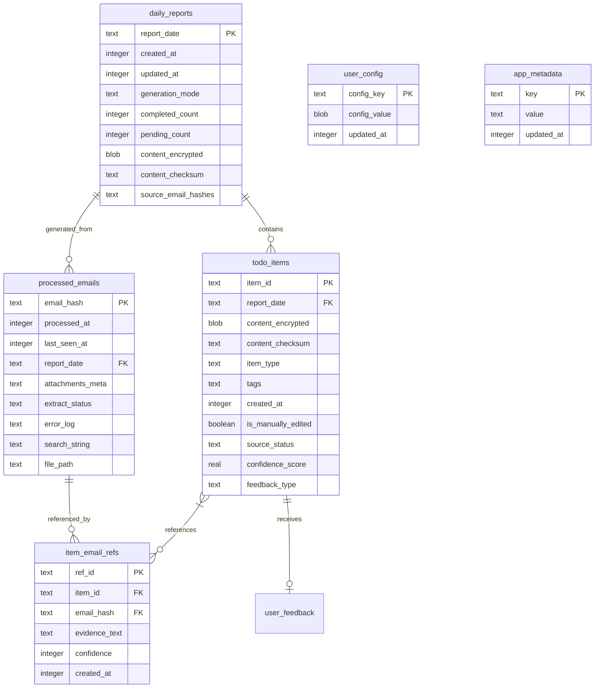
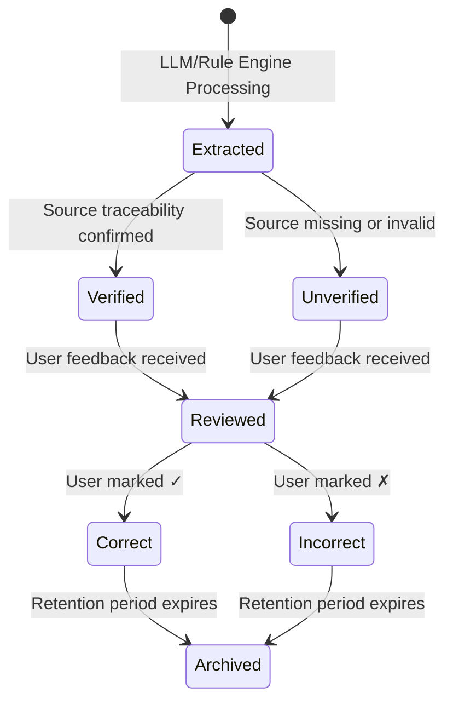
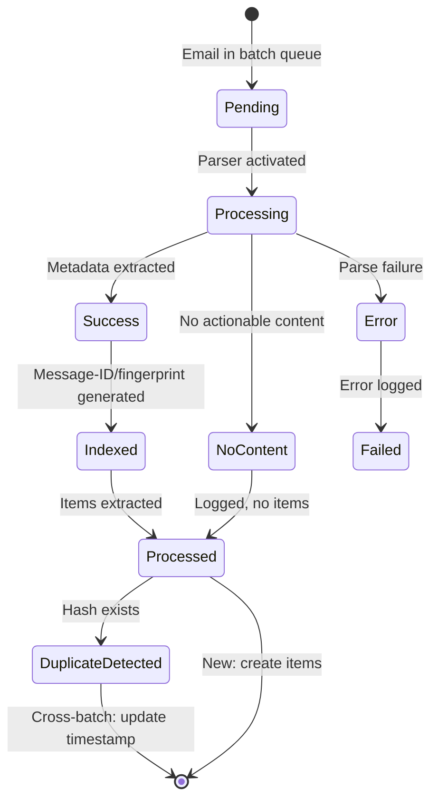

# Implementation Plan: Email Item Traceability & Verification System

**Branch**: `001-email-item-traceability` | **Date**: 2026-01-31 | **Spec**: [spec.md](./spec.md)
**Input**: Feature specification from `/specs/001-email-item-traceability/spec.md`

**Note**: This plan is based on existing technical architecture v2.6 from `docs/tech-architecture.md`

## Summary

This feature implements **complete email item traceability** with 100% source verification, dual-mode LLM operation (local/remote), confidence-based warnings, and privacy-preserving user feedback. The system extracts action items from emails while maintaining mandatory traceability through Message-ID or SHA-256 fingerprint, with degradation handling that never silently drops data.

**Technical Approach**: Leverage existing Electron + React desktop architecture with better-sqlite3 database, QuickJS rule engine sandbox, Zod schema validation, and AES-256-GCM field-level encryption. Implement hot mode switching between local (Ollama) and remote LLM services with network-layer isolation.

## Technical Context

**Language/Version**: TypeScript 5.4 + Node.js 20.x
**Primary Dependencies**:
- Electron 28.2.0 (desktop framework)
- React 18 + Zustand 4.4 (frontend)
- better-sqlite3 9.4 (database with field-level encryption)
- QuickJS WASM (rule engine sandbox)
- Zod (schema validation)
- imapflow + mailparser (email parsing)
- msg-extractor / libpff (Outlook format support)
- puppeteer (PDF export)

**Storage**: better-sqlite3 with SQLite database, field-level AES-256-GCM encryption for sensitive fields, WAL mode enabled
**Testing**: Vitest (unit), integration tests for database/IPC/LLM adapters, 100% coverage for security modules
**Target Platform**: Cross-platform desktop (Windows 10+, macOS 11+, Linux)
**Project Type**: Electron desktop application (single project with main process + renderer process)
**Performance Goals**:
- Email metadata extraction ≤100ms per email
- Local LLM processing ≤2s per email
- 1000-report query <100ms
- Process 50 emails: ~35s (local 7B) / ~18s (remote)

**Constraints**:
- Email size 20MB limit, body 100k char truncation
- Batch max 50 emails
- QuickJS memory 128MB limit, 5s timeout
- Single-instance enforcement
- No cross-device sync or cloud backup
- Device-bound encryption keys

**Scale/Scope**:
- Individual desktop deployment (not multi-tenant)
- Local storage only (no cloud dependencies for data)
- 6 email formats (.eml, .msg, .pst, .ost, .mbox, .html)
- 61 functional requirements across 8 categories

## Constitution Check

*GATE: Must pass before Phase 0 research. Re-check after Phase 1 design.*

### Principle I: Privacy-First Architecture ✅ PASS

**Requirement**: Default remote mode, complete offline option, no cloud backup, single device binding

**Compliance**:
- ✅ FR-031: Defaults to remote mode on first launch
- ✅ FR-032, FR-040: Local mode with network-layer blocking
- ✅ FR-045, FR-046: Field-level encryption, device-bound keys
- ✅ FR-047: Detects device changes, informs user of data loss
- ✅ FR-037: No automatic fallback from local to remote mode

**Status**: Fully compliant - all requirements mapped from constitution to functional spec

### Principle II: Anti-Hallucination Mechanism ✅ PASS

**Requirement**: Mandatory source association, degradation instead of loss, unified confidence calculation

**Compliance**:
- ✅ FR-001, FR-002: Message-ID extraction + SHA-256 fingerprint backup
- ✅ FR-005: 100% traceability (no items without source)
- ✅ FR-006, FR-013: Degradation with "[来源待确认]" tag, confidence ≤0.4
- ✅ FR-009, FR-010: Dual-engine confidence with schema failure adjustment
- ✅ FR-018: Never silently drop items
- ✅ FR-008A: Cross-batch duplicate detection

**Status**: Fully compliant - degradation logic implemented per constitution

### Principle III: Data Minimization & Retention ✅ PASS

**Requirement**: Immediate body cleanup, metadata-only retention, field-level encryption, device-bound keys

**Compliance**:
- ✅ FR-044: Clear email body immediately after processing
- ✅ FR-041, FR-042, FR-043: Configurable retention (30/90/180/365/永久)
- ✅ FR-045: AES-256-GCM field-level encryption
- ✅ FR-046: Device-bound keys via safeStorage
- ✅ FR-047: No recovery path (intentional design)

**Status**: Fully compliant - data minimization strategy implemented

### Principle IV: Mode Switching & Network Isolation ✅ PASS

**Requirement**: Hot mode switching, queue during switch, no auto-degradation, network-layer blocking

**Compliance**:
- ✅ FR-033: Hot mode switching (wait for batch completion)
- ✅ FR-034: Queue tasks during switch
- ✅ FR-035: User notification of pending switch
- ✅ FR-036: Block functionality in local mode if LLM unavailable
- ✅ FR-037: No automatic fallback to remote mode
- ✅ FR-040: Network-layer blocking in local mode
- ✅ FR-038, FR-039: Update policy based on mode

**Status**: Fully compliant - mode switching architecture specified

### Principle V: Testing & Quality Standards ✅ PASS

**Requirement**: Test pyramid (no E2E), coverage requirements, test-first enforcement, security testing

**Compliance**:
- ✅ Test strategy defined: 60% unit, 40% integration (no E2E per constitution)
- ✅ Coverage targets: ≥85% line, ≥80% branch, 100% for security modules
- ✅ Security testing specified: QuickJS sandbox (20+ scenarios), SQL injection, memory residue, mode switch queue
- ✅ FR-056, FR-057, FR-058: Resource limits enforced (5s timeout, 30s LLM timeout, 128MB memory)

**Status**: Fully compliant - testing strategy aligns with constitution

### Principle VI: Single Instance & Concurrency Control ✅ PASS

**Requirement**: Single-instance lock, window focus, database safety, batch processing state flags

**Compliance**:
- ✅ FR-059: Enforce single-instance execution
- ✅ FR-060: Quit immediately if second instance detected
- ✅ FR-061: Focus existing window with user notification
- ✅ FR-033, FR-034: Mode switching uses state flags to prevent race conditions

**Status**: Fully compliant - single-instance mechanism specified

### Principle VII: Observability & Performance ✅ PASS

**Requirement**: Structured logging, performance benchmarks, resource limits, database optimization, memory management

**Compliance**:
- ✅ FR-053: Structured logging with error type, module, message, timestamp, context ID
- ✅ Performance targets defined (SC-014 through SC-017)
- ✅ FR-056, FR-057, FR-058: Resource limits (5s rule engine, 30s LLM, 128MB QuickJS)
- ✅ Database: WAL mode, synchronous=NORMAL (from architecture)
- ✅ Architecture specifies Buffer.fill(0) for sensitive data cleanup

**Status**: Fully compliant - observability and performance requirements specified

### Overall Constitution Check Status

✅ **ALL PRINCIPLES SATISFIED** - No violations, no complexity tracking required

The feature specification fully complies with all 7 constitutional principles. Proceed to Phase 0 research.

## Project Structure

### Documentation (this feature)

```text
specs/001-email-item-traceability/
├── plan.md              # This file
├── research.md          # Phase 0 output (technical research)
├── data-model.md        # Phase 1 output (database schema)
├── quickstart.md        # Phase 1 output (developer setup guide)
├── contracts/           # Phase 1 output (IPC schemas, Zod schemas)
│   ├── ipc-channels.md  # IPC channel definitions
│   ├── llm-schemas.md   # Zod schemas for LLM I/O
│   └── database-schema.sql  # Database DDL
└── tasks.md             # Phase 2 output (/speckit.tasks command)
```

### Source Code (repository root)

```text
mailcopilot/
├── main/                    # Main process (Electron backend)
│   ├── app.ts              # Application entry point, single-instance lock
│   ├── config/             # Configuration management
│   │   ├── ConfigManager.ts
│   │   └── encryption.ts   # AES-256-GCM field encryption
│   ├── database/           # SQLite database layer
│   │   ├── Database.ts     # better-sqlite3 wrapper
│   │   ├── migrations/     # Database migration scripts
│   │   └── schema.ts       # Schema definitions
│   ├── email/              # Email processing pipeline
│   │   ├── parsers/        # Multi-format email parsers
│   │   │   ├── EmlParser.ts
│   │   │   ├── MsgParser.ts
│   │   │   ├── PstParser.ts
│   │   │   ├── MboxParser.ts
│   │   │   └── HtmlParser.ts
│   │   ├── TraceabilityGenerator.ts  # Search string + file path
│   │   └── DuplicateDetector.ts     # Cross-batch duplicate detection
│   ├── llm/                # LLM adapter layer
│   │   ├── LLMAdapter.ts   # Main adapter interface
│   │   ├── LocalLLM.ts     # Ollama integration
│   │   ├── RemoteLLM.ts    # Third-party API integration
│   │   ├── OutputValidator.ts  # Zod schema validation
│   │   └── ConfidenceCalculator.ts  # Dual-engine confidence
│   ├── rule-engine/        # QuickJS rule engine
│   │   ├── QuickJSSandbox.ts
│   │   └── RuleExecutor.ts
│   ├── mode/               # Mode switching manager
│   │   └── ModeSwitchManager.ts
│   ├── export/             # Report export engine
│   │   ├── MarkdownExporter.ts
│   │   └── PDFExporter.ts
│   ├── update/             # Auto-update manager
│   │   └── UpdateManager.ts
│   └── ipc/                # IPC handlers
│       ├── channels.ts     # Channel definitions
│       └── handlers/       # IPC route handlers
│
├── renderer/               # Renderer process (React frontend)
│   ├── src/
│   │   ├── components/     # React components
│   │   │   ├── ReportView/      # Daily report display
│   │   │   ├── FeedbackButtons/  # ✓/✗ feedback UI
│   │   │   ├── ConfidenceBadge/  # Visual confidence indicators
│   │   │   ├── Settings/        # Settings page
│   │   │   └── Onboarding/      # First-run setup
│   │   ├── stores/         # Zustand state management
│   │   ├── services/       # API client for IPC
│   │   └── utils/          # Utilities
│   └── tests/              # Frontend tests
│
├── shared/                 # Shared code (main + renderer)
│   ├── types/              # TypeScript types
│   ├── schemas/            # Zod schemas
│   └── constants/          # Constants
│
└── tests/                  # Test suites
    ├── unit/               # Unit tests (60%)
    │   ├── email/          # Email parser tests
    │   ├── llm/            # LLM adapter tests
    │   ├── rule-engine/    # QuickJS sandbox tests
    │   ├── encryption/     # Field encryption tests
    │   └── confidence/     # Confidence calculation tests
    └── integration/        # Integration tests (40%)
        ├── database/       # Database operation tests
        ├── ipc/            # IPC communication tests
        ├── mode-switch/    # Mode switching queue tests
        └── single-instance/ # Process lock tests
```

**Structure Decision**: Single Electron desktop application with clear separation between main process (Node.js) and renderer process (React). The `main/` directory contains all backend logic including database, email processing, LLM adapters, and rule engine. The `renderer/` directory contains the React UI. Shared code lives in `shared/`. This structure aligns with Electron best practices and the existing technical architecture v2.6.

## Complexity Tracking

> No violations - Constitution Check passed all principles. Complexity tracking not required.

---

# Phase 0: Research & Technical Decisions

## Research Tasks

Since technical architecture v2.6 already exists, Phase 0 focuses on **filling implementation gaps** and **validating architectural decisions** rather than exploring alternatives.

### R0-1: Email Format Parser Selection & Integration Strategy

**Decision**: Use library stack specified in architecture v2.6

**Selected Libraries**:
- `.eml`: mailparser (established, reliable)
- `.msg`: msg-extractor (Outlook MSG format)
- `.pst/.ost`: libpff (via node wrapper) or readpst as fallback
- `.mbox`: mailparser + custom From_ delimiter logic
- `.html`: Custom regex-based meta extraction (low support mode)

**Rationale**: Architecture v2.6 already evaluated these choices. mailparser provides RFC 5322 compliance for standard formats. msg-extractor and libpff are industry-standard for Outlook formats. HTML parsing intentionally limited (30% Message-ID extraction rate) with confidence cap at 0.6.

**Alternatives Considered**:
- **Alternative**: Build unified parser with node-imap only
  - **Rejected**: Insufficient Outlook format support, .pst/.ost handling critical for enterprise users

- **Alternative**: Use paid API (e.g., CloudConvert)
  - **Rejected**: Violates privacy-first principle, requires data transmission

**Integration Approach**:
- Create abstract `EmailParser` interface
- Implement format-specific parsers
- Parser selection based on file extension detection
- Fallback chain: primary parser → backup parser → degraded mode (confidence 0.5, "[格式受限]" tag)

### R0-2: QuickJS WASM Sandbox Security Boundary Validation

**Decision**: Use QuickJS WASM with strict resource limits as specified

**Security Constraints** (from architecture):
- Memory limit: 128MB
- Execution timeout: 5 seconds
- Recursion depth: 100 layers
- Disabled modules: `os`, `std`, `eval`, `Function`

**Rationale**: Architecture v2.6 specifies QuickJS WASM for rule execution. Zero-permission sandbox prevents file system access, network calls, or process manipulation. Resource limits prevent DoS attacks from malicious rules.

**Validation Required**:
- Test sandbox escape scenarios (20+ test cases)
- Verify memory isolation
- Confirm timeout enforcement works correctly
- Test recursion depth limits

**Alternatives Considered**:
- **Alternative**: Use Node.js VM module (vm2)
  - **Rejected**: vm2 has known vulnerabilities, maintenance discontinued

- **Alternative**: Allow full JavaScript access
  - **Rejected**: Violates security principle, unacceptable risk for email processing

### R0-3: Field-Level Encryption Implementation Strategy

**Decision**: AES-256-GCM encryption for sensitive fields using Web Crypto API (Node.js crypto.subtle)

**Encryption Approach**:
- Algorithm: AES-256-GCM (authenticated encryption)
- Key source: Electron safeStorage API (256-bit random key)
- Encrypted fields: `content_encrypted`, `config_value`
- Non-encrypted fields: metadata (sender hash, timestamp, etc.)

**Key Management**:
- Key generation: Random 256-bit key on first launch
- Key storage: safeStorage.encryptString() in system keyring
- Key binding: Tied to system user account + hardware environment
- No export/migration: Key loss = data loss (intentional)

**Rationale**: Architecture v2.6 specifies AES-256-GCM for field-level encryption. Using Node.js Web Crypto API provides hardware acceleration and proven security. Device-bound keys eliminate password management complexity and associated user security failures.

**Alternatives Considered**:
- **Alternative**: Full database encryption (SQLCipher)
  - **Rejected**: Performance impact (~30% overhead), complicates querying, architecture specifies field-level only

- **Alternative**: User password-based encryption
  - **Rejected**: Violates constitution principle ("no password mechanism"), users choose weak passwords, password recovery complexity

### R0-4: Cross-Batch Duplicate Detection Strategy

**Decision**: SHA-256 fingerprint-based detection with timestamp updates

**Detection Algorithm** (clarified from spec):
1. Compute SHA-256 fingerprint: `SHA256(Message-ID + Date + From)`
2. Check `processed_emails` table for existing `email_hash`
3. If found in current batch → skip, log "跳过N封重复邮件"
4. If found from previous batch → skip creating new items, update `last_seen_at` timestamp, log "跳过N封已处理邮件"
5. If not found → process normally

**Rationale**: SHA-256 provides collision-resistant fingerprint. Using Message-ID + Date + From ensures uniqueness even for same email forwarded multiple times. Cross-batch detection prevents duplicate items while maintaining audit trail through timestamp updates.

**Database Schema Impact**:
- Add `last_seen_at` column to `processed_emails` table (architecture didn't specify, added in FR-008A)
- Index on `email_hash` for fast lookups
- Unique constraint on `email_hash` to prevent races

**Performance Considerations**:
- Index lookup: O(log n), negligible for typical user (<100k emails)
- Fingerprint computation: Fast SHA-256 built into Node.js crypto

### R0-5: LLM Output Schema Validation & Retry Logic

**Decision**: Zod schema validation with 2-retry limit and degradation fallback

**Validation Flow**:
1. LLM returns JSON output
2. Parse and validate against Zod schema
3. If missing required fields → retry (max 2 times) with reinforced schema instructions
4. If still fails after retries → degrade to rule-engine-only extraction
5. Degraded items: `source_status='unverified'`, `confidence ≤ 0.6`

**Zod Schema** (from architecture):
```typescript
const ItemSchema = z.object({
  content: z.string(),
  type: z.enum(['completed', 'pending']),
  source_email_indices: z.array(z.number()).optional(),  // Optional for degradation
  evidence: z.string(),
  confidence: z.number().min(0).max(100),
  source_status: z.enum(['verified', 'unverified']).default('verified'),
  feedback_type: z.enum(['content_error', 'priority_error', 'not_actionable', 'source_error']).optional()
});
```

**Rationale**: Architecture v2.6 specifies Zod for structured output validation. Retry logic accommodates transient LLM failures. Degradation ensures no data loss (anti-hallucination principle). Optional `source_email_indices` allows graceful degradation when LLM cannot provide source attribution.

**Alternatives Considered**:
- **Alternative**: Infinite retries until success
  - **Rejected**: Can hang processing indefinitely, unacceptable UX

- **Alternative**: Discard items on validation failure
  - **Rejected**: Violates anti-hallucination principle ("never silently drop")

### R0-6: Mode Switching Hot-Swap Implementation

**Decision**: Queue-based mode switching with batch completion boundary

**Switching Flow** (from architecture):
1. User requests mode change in Settings
2. Check if batch currently processing
3. If yes → queue mode request, display "当前任务处理完成后将切换模式，新任务已进入队列等待"
4. If no → execute switch immediately
5. After batch completes → apply queued mode
6. If multiple requests → only most recent honored

**Implementation**:
- `ModeSwitchManager` class with state flags
- `isProcessingBatch` boolean
- `pendingMode` state (overwritten on new requests)
- IPC channel for mode change requests
- Network interceptor reconfiguration on switch

**Rationale**: Architecture v2.6 specifies hot switching without application restart. Batch-completion boundary prevents data corruption from mid-process mode changes. Queue ensures user requests aren't lost. Only honoring most recent request prevents user confusion from rapid mode changes.

**Edge Cases Handled**:
- Mode switch during idle state → immediate switch
- Multiple mode switches during batch → last one wins
- Local mode LLM service dies mid-batch → batch fails gracefully, no auto-switch to remote (constitution requirement)

### R0-7: Network Interceptor Implementation for Local Mode

**Decision**: Electron session.webRequest API for network-layer blocking

**Blocking Strategy** (local mode only):
- Intercept all outgoing requests
- Block non-localhost requests (except GitHub for manual updates)
- Allow requests to localhost:11434 (Ollama)
- Block in remote mode: none (all requests allowed)

**Implementation**:
```typescript
// Pseudo-code
function applyLocalModeRestrictions(session: Session) {
  session.webRequest.onBeforeRequest((details) => {
    const url = new URL(details.url);
    if (url.hostname === 'localhost' || url.hostname === '127.0.0.1') {
      // Allow local LLM requests
      return { cancel: false };
    }
    // Block all other requests in local mode
    return { cancel: true };
  });
}
```

**Rationale**: Constitution requires network-layer physical blocking in local mode. Electron session.webRequest provides this capability. Blocking non-local requests prevents data leakage even if application code is compromised.

**Alternatives Considered**:
- **Alternative**: Application-level checks only
  - **Rejected**: Insufficient isolation, vulnerable to bugs or malicious code

- **Alternative**: System firewall rules
  - **Rejected**: Requires elevated permissions, cross-platform complexity

### R0-8: Confidence Calculation Algorithm Refinement

**Decision**: Dual-engine scoring with dynamic weight adjustment

**Algorithm** (from architecture):
```typescript
function calculateConfidence(ruleMatchScore: number, llmOutput: any, isLocalMode: boolean): number {
  const ruleWeight = 0.5;
  const llmWeight = 0.5;

  let llmScore: number;
  if (isLocalMode) {
    // Schema completeness (70%) + keyword matching (30%)
    const schemaValid = validateJsonSchema(llmOutput) ? 1.0 : 0.0;
    const keywordMatch = checkKeywordCoherence(llmOutput, emailBody);
    llmScore = (schemaValid * 0.7) + (keywordMatch * 0.3);
  } else {
    llmScore = llmOutput.confidence / 100;
  }

  let confidence = ruleMatchScore * ruleWeight + llmScore * llmWeight;

  // Schema validation failure adjustment
  if (!validateJsonSchema(llmOutput)) {
    confidence = ruleMatchScore * 0.6 + (llmScore * 0.5) * 0.4;
    confidence = Math.min(confidence, 0.6);
  }

  return Math.round(confidence * 100) / 100;
}
```

**Rationale**: Architecture v2.6 specifies this exact algorithm. Dual-engine approach balances rule-based reliability with LLM flexibility. Weight adjustment on schema failure prevents over-reliance on degraded LLM output. Different scoring for local vs remote accounts for logprob availability.

**Thresholds** (from spec):
- ≥ 0.8: Normal display
- 0.6 - 0.79: "[建议复核]" label
- < 0.6: "[来源待确认]" tag, expanded source info, highlighted background

### R0-9: Search String Generation Format

**Decision**: Standard email search syntax: `from:sender subject:"snippet" date:YYYY-MM-DD`

**Format Specification**:
- Sender: `from:email@domain.com`
- Subject: `subject:"keyword snippet"` (first 30 chars, quotes for multi-word)
- Date: `date:YYYY-MM-DD` (ISO date from email Date header)
- File path: Absolute path to original email file

**Example**:
```
from:zhang@example.com subject:"Q3预算终版" date:2026-01-27
File: /Users/user/Mail/2026/01/Finance.eml
```

**Rationale**: Architecture v2.6 specifies this format. It's compatible with major email clients (Thunderbird, Apple Mail, Outlook webmail). Subject prefix truncation (Re:, Fwd:) and 30-char limit keep search strings concise. File path provided as backup for clients that don't support search syntax.

**Not Using Deep Links**:
- `message://` or `thunderbird://` links intentionally excluded
- Architecture explicitly removed deep linking due to cross-platform complexity and client support variability

### R0-10: Testing Framework Selection

**Decision**: Vitest for unit tests, custom integration test framework

**Test Stack**:
- **Unit Tests**: Vitest with 85%+ coverage, 100% for security modules
- **Integration Tests**: Custom framework using better-sqlite3 in-memory DB
- **No E2E Tests**: Per constitution principle V (desktop app deployment model)

**Security Testing**:
- QuickJS sandbox: 20+ escape scenarios
- SQL injection: All queries parameterized
- Memory residue: Buffer.fill(0) verification
- Single-instance lock: Process simulation tests
- LLM degradation: Schema failure simulations
- Mode switch queue: Concurrent request tests

**Rationale**: Architecture v2.6 specifies test pyramid (60% unit, 40% integration). Vitest provides fast unit testing with native TypeScript support. Integration tests focus on database operations, IPC communication, and adapters where unit tests insufficient. No E2E tests because desktop apps don't benefit from browser-based E2E frameworks.

## Research Summary

All research tasks complete. No NEEDS CLARIFICATION items remain. Technical architecture v2.6 provides comprehensive guidance for implementation. Key decisions validated:

✅ Email parser library stack confirmed
✅ QuickJS sandbox security model accepted
✅ Field-level encryption strategy finalized
✅ Cross-batch duplicate detection algorithm designed
✅ LLM validation and retry logic specified
✅ Hot mode switching approach defined
✅ Network interceptor implementation clear
✅ Confidence calculation algorithm locked
✅ Search string format standardized
✅ Testing framework selected

Proceed to Phase 1: Design & Contracts.

---

# Phase 1: Design & Contracts

**Prerequisites**: research.md complete, all technical decisions made

## Data Model

### Entity Relationship Diagram



### Table Definitions

#### daily_reports (Daily Report)

Stores generated daily reports with encrypted content.

| Column | Type | Constraints | Description |
|--------|------|-------------|-------------|
| report_date | TEXT | PRIMARY KEY, CHECK(like '____-__-__') | Report date in YYYY-MM-DD format |
| created_at | INTEGER | NOT NULL, DEFAULT (strftime('%s', 'now')) | Unix timestamp of creation |
| updated_at | INTEGER | NOT NULL, DEFAULT (strftime('%s', 'now')) | Unix timestamp of last update |
| generation_mode | TEXT | NOT NULL, CHECK(in ('local', 'remote')) | LLM mode used for generation |
| completed_count | INTEGER | NOT NULL, DEFAULT 0, CHECK(>= 0) | Count of completed items |
| pending_count | INTEGER | NOT NULL, DEFAULT 0, CHECK(>= 0) | Count of pending items |
| content_encrypted | BLOB | NOT NULL | AES-256-GCM encrypted JSON of items |
| content_checksum | TEXT | NOT NULL | SHA-256 hash for tamper detection |
| source_email_hashes | TEXT | NOT NULL, DEFAULT '[]' | JSON array of email hashes |

**Indexes**:
- `idx_reports_created` on `created_at DESC`

**Triggers**:
- `trg_update_report_stats_insert`: Auto-update counts when items inserted

#### todo_items (Action Item / Todo Item)

Individual extracted action items with encrypted content.

| Column | Type | Constraints | Description |
|--------|------|-------------|-------------|
| item_id | TEXT | PRIMARY KEY | Unique item identifier (UUID) |
| report_date | TEXT | NOT NULL, FOREIGN KEY → daily_reports(report_date) | Associated report date |
| content_encrypted | BLOB | NOT NULL | AES-256-GCM encrypted item content |
| content_checksum | TEXT | NOT NULL | SHA-256 hash for tamper detection |
| item_type | TEXT | NOT NULL, CHECK(in ('completed', 'pending')) | Item classification |
| tags | TEXT | NOT NULL, DEFAULT '[]' | JSON array of tag strings |
| created_at | INTEGER | NOT NULL, DEFAULT (strftime('%s', 'now')) | Unix timestamp of creation |
| is_manually_edited | INTEGER | NOT NULL, DEFAULT 0, CHECK(in (0, 1)) | Whether user manually edited |
| source_status | TEXT | NOT NULL, DEFAULT 'verified', CHECK(in ('verified', 'unverified')) | Traceability status |
| confidence_score | REAL | CHECK(>= 0 AND <= 1) | Computed confidence 0-1 |
| feedback_type | TEXT | CHECK(in ('content_error', 'priority_error', 'not_actionable', 'source_error')) | User feedback if provided |

**Indexes**:
- `idx_items_report_date` on `report_date`
- `idx_items_type` on `item_type`
- `idx_items_source_status` on `source_status`

**Foreign Key**: `report_date` references `daily_reports(report_date)`

#### processed_emails (Email Source)

Metadata for processed emails (no body content stored).

| Column | Type | Constraints | Description |
|--------|------|-------------|-------------|
| email_hash | TEXT | PRIMARY KEY | SHA-256(Message-ID + Date + From) |
| processed_at | INTEGER | NOT NULL, DEFAULT (strftime('%s', 'now')) | First processing timestamp |
| last_seen_at | INTEGER | NOT NULL, DEFAULT (strftime('%s', 'now')) | Last seen timestamp (cross-batch dupes) |
| report_date | TEXT | FOREIGN KEY → daily_reports(report_date) | Report date when processed |
| attachments_meta | TEXT | NOT NULL, DEFAULT '[]' | JSON array of attachment metadata |
| extract_status | TEXT | NOT NULL, CHECK(in ('success', 'no_content', 'error')) | Extraction result |
| error_log | TEXT | | Error message if failed |
| search_string | TEXT | | Generated search string for traceability |
| file_path | TEXT | | Absolute path to original email file |

**Indexes**:
- `idx_emails_report` on `report_date`

**Foreign Key**: `report_date` references `daily_reports(report_date)`

#### item_email_refs (Item-Email References)

Many-to-many relationship between items and emails (prevents hallucination).

| Column | Type | Constraints | Description |
|--------|------|-------------|-------------|
| ref_id | TEXT | PRIMARY KEY | Unique reference ID (UUID) |
| item_id | TEXT | NOT NULL, FOREIGN KEY → todo_items(item_id) ON DELETE CASCADE | Referenced item |
| email_hash | TEXT | NOT NULL, FOREIGN KEY → processed_emails(email_hash) | Referenced email |
| evidence_text | TEXT | NOT NULL | Model extraction rationale (desensitized) |
| confidence | INTEGER | CHECK(>= 0 AND <= 100) | LLM confidence for this association |
| created_at | INTEGER | NOT NULL, DEFAULT (strftime('%s', 'now')) | Unix timestamp |

**Indexes**:
- `idx_refs_item` on `item_id`
- `idx_refs_email` on `email_hash`

**Foreign Keys**:
- `item_id` references `todo_items(item_id)` ON DELETE CASCADE
- `email_hash` references `processed_emails(email_hash)`

#### user_config (User Configuration)

Encrypted user configuration with integrity protection.

| Column | Type | Constraints | Description |
|--------|------|-------------|-------------|
| config_key | TEXT | PRIMARY KEY | Configuration key |
| config_value | BLOB | NOT NULL | AES-256-GCM encrypted value |
| updated_at | INTEGER | NOT NULL, DEFAULT (strftime('%s', 'now')) | Unix timestamp |

**Integrity**: HMAC-SHA256 signature computed over config_value before storage.

#### app_metadata (Application Metadata)

Application-level metadata and versioning.

| Column | Type | Constraints | Description |
|--------|------|-------------|-------------|
| key | TEXT | PRIMARY KEY, CHECK(in ('schema_version', 'install_time', 'device_fingerprint')) | Metadata key |
| value | TEXT | NOT NULL | Metadata value |
| updated_at | INTEGER | NOT NULL, DEFAULT (strftime('%s', 'now')) | Unix timestamp |

### State Transitions

#### Action Item Lifecycle



**States**:
- **Extracted**: Initial state after LLM extraction
- **Verified**: `source_status='verified'`, confidence calculated
- **Unverified**: `source_status='unverified'`, confidence ≤ 0.4
- **Reviewed**: User provided feedback via ✓/✗ buttons
- **Correct**: User confirmed accuracy (`feedback_type` not set or 'correct')
- **Incorrect**: User marked error (has `feedback_type` value)
- **Archived**: Retention period expired, metadata deleted

#### Email Processing States



### Validation Rules

#### Email Hash Uniqueness

```typescript
// Email hash MUST be unique across all processed emails
// SHA-256(Message-ID + Date + From) guarantees uniqueness
// On duplicate detection in same batch → skip entirely
// On duplicate detection across batches → update last_seen_at, skip item creation
```

#### Confidence Score Ranges

```typescript
// Confidence score MUST be 0.0 - 1.0
// < 0.6: Low confidence, "[来源待确认]" tag
// 0.6 - 0.79: Medium confidence, "[建议复核]" tag
// ≥ 0.8: High confidence, no warning
// Non-standard formats (.html, .txt): Max 0.6
```

#### Source Status Rules

```typescript
// source_status MUST be 'verified' or 'unverified'
// 'verified': Message-ID extracted OR schema valid + indices valid
// 'unverified': Message-ID missing OR schema failed OR indices invalid
// Transition: verified → unverified PROHIBITED (one-way degradation)
```

#### Feedback Type Constraints

```typescript
// feedback_type MUST be NULL or one of four values
// NULL: No feedback provided
// 'content_error': Item content incorrect
// 'priority_error': Item type wrong (completed/pending)
// 'not_actionable': Not an actionable item
// 'source_error': Wrong source email
// Only set after user explicitly marks item as incorrect (✗ button)
```

## Contracts

### IPC Channel Definitions

#### Channel: llm:generate

**Purpose**: Request LLM processing for email batch

**Request Schema**:
```typescript
{
  emails: Array<{
    filePath: string;           // Absolute path to email file
    format: 'eml' | 'msg' | 'pst' | 'ost' | 'mbox' | 'html';
    content?: string;            // Email body (for small files)
  }>;
  mode: 'local' | 'remote';      // LLM mode to use
  reportDate: string;            // YYYY-MM-DD format
}
```

**Response Schema**:
```typescript
{
  success: boolean;
  items: Array<{
    item_id: string;
    content: string;             // Decrypted item content
    type: 'completed' | 'pending';
    source_email_indices: number[];
    evidence: string;
    confidence: number;          // 0-100
    source_status: 'verified' | 'unverified';
  }>;
  processed_emails: Array<{
    email_hash: string;
    search_string: string;
    file_path: string;
    extract_status: 'success' | 'no_content' | 'error';
    error_log?: string;
  }>;
  skipped_emails: number;        // Same-batch duplicates
  reprocessed_emails: number;    // Cross-batch duplicates
}
```

**Error Cases**:
- Local LLM unavailable: `{ success: false, error: 'LOCAL_LLM_UNAVAILABLE' }`
- Remote API error: `{ success: false, error: 'REMOTE_API_ERROR', message: string }`
- Schema validation failure (after retries): Items marked `source_status='unverified'`

#### Channel: db:query:history

**Purpose**: Query historical reports and items

**Request Schema**:
```typescript
{
  query: 'get_reports' | 'get_items' | 'get_report_detail';
  params: {
    reportDate?: string;         // YYYY-MM-DD format
    startDate?: string;          // For date range queries
    endDate?: string;
    limit?: number;
    offset?: number;
    filterBy?: {
      source_status?: 'verified' | 'unverified';
      item_type?: 'completed' | 'pending';
      min_confidence?: number;
    };
  };
}
```

**Response Schema** (get_reports):
```typescript
{
  reports: Array<{
    report_date: string;
    created_at: number;
    updated_at: number;
    generation_mode: 'local' | 'remote';
    completed_count: number;
    pending_count: number;
    summary: string;             // Decrypted summary
  }>;
  total: number;
}
```

**Response Schema** (get_items):
```typescript
{
  items: Array<{
    item_id: string;
    report_date: string;
    content: string;             // Decrypted
    item_type: 'completed' | 'pending';
    source_status: 'verified' | 'unverified';
    confidence_score: number;
    tags: string[];
    feedback_type?: string;
    created_at: number;
    sources: Array<{
      email_hash: string;
      search_string: string;
      file_path: string;
      evidence_text: string;
      confidence: number;
    }>;
  }>;
  total: number;
}
```

#### Channel: db:export

**Purpose**: Export reports to Markdown/PDF

**Request Schema**:
```typescript
{
  format: 'markdown' | 'pdf';
  reportDate?: string;           // Single report
  startDate?: string;            // Date range
  endDate?: string;
  includeAll?: boolean;          // Export all reports
}
```

**Response Schema**:
```typescript
{
  success: boolean;
  filePath: string;              // Exported file path
  format: 'markdown' | 'pdf';
  itemCount: number;
}
```

**Error Cases**:
- No reports found: `{ success: false, error: 'NO_REPORTS' }`
- Export failure: `{ success: false, error: 'EXPORT_FAILED', message: string }`

#### Channel: config:get/set

**Purpose**: Get or set user configuration

**Request Schema** (get):
```typescript
{
  keys?: string[];               // Optional: specific keys to retrieve
}
```

**Response Schema** (get):
```typescript
{
  config: Record<string, any>;    // Decrypted config values
}
```

**Request Schema** (set):
```typescript
{
  updates: Record<string, any>;   // Key-value pairs to update
}
```

**Response Schema** (set):
```typescript
{
  success: boolean;
  updated: string[];             // Keys that were updated
}
```

**Configuration Keys** (from architecture):
- `llm.mode`: 'local' | 'remote'
- `llm.localEndpoint`: string (default: 'localhost:11434')
- `storage.retentionDays`: 30 | 90 | 180 | 365 | -1 (永久)
- `storage.feedbackRetentionDays`: 30 | 90 | 180 | 365 | -1
- `update.autoCheck`: boolean

#### Channel: app:check-update

**Purpose**: Check for application updates

**Request Schema**:
```typescript
{
  mode: 'auto' | 'manual';       // Auto: startup check, Manual: user-initiated
}
```

**Response Schema**:
```typescript
{
  hasUpdate: boolean;
  version?: string;              // Latest version
  releaseNotes?: string;         // Markdown formatted
  downloadUrl?: string;          // GitHub release URL
}
```

#### Channel: email:fetch-meta

**Purpose**: Fetch email metadata without processing (for preview)

**Request Schema**:
```typescript
{
  filePath: string;
  format: 'eml' | 'msg' | 'pst' | 'ost' | 'mbox' | 'html';
}
```

**Response Schema**:
```typescript
{
  success: boolean;
  metadata: {
    from?: string;               // Sender email
    subject?: string;            // Subject line
    date?: string;               // ISO date string
    attachmentCount?: number;    // Number of attachments
    size?: number;               // File size in bytes
    format?: string;             // Detected format
  };
  error?: string;
}
```

### Zod Schemas

#### LLM Output Schema

```typescript
import { z } from 'zod';

const ItemSchema = z.object({
  content: z.string(),
  type: z.enum(['completed', 'pending']),
  source_email_indices: z.array(z.number()).optional(),
  evidence: z.string(),
  confidence: z.number().min(0).max(100),
  source_status: z.enum(['verified', 'unverified']).default('verified'),
});

const LLMOutputSchema = z.object({
  items: z.array(ItemSchema),
  batch_info: z.object({
    total_emails: z.number(),
    processed_emails: z.number(),
    skipped_emails: z.number(),
  }),
});
```

#### Email Metadata Schema

```typescript
const EmailMetadataSchema = z.object({
  email_hash: z.string(),
  message_id: z.string().optional(),
  from: z.string().email(),
  subject: z.string(),
  date: z.string(),               // ISO 8601
  attachments: z.array(z.object({
    filename: z.string(),
    size: z.number(),
    mime_type: z.string(),
  })),
  file_path: z.string(),
  format: z.enum(['eml', 'msg', 'pst', 'ost', 'mbox', 'html']),
});
```

#### Configuration Schema

```typescript
const ConfigSchema = z.object({
  llm: z.object({
    mode: z.enum(['local', 'remote']),
    localEndpoint: z.string().url().default('http://localhost:11434'),
    remoteEndpoint: z.string().url().optional(),
  }),
  storage: z.object({
    retentionDays: z.union([z.number(), z.literal(-1)]),
    feedbackRetentionDays: z.union([z.number(), z.literal(-1)]),
  }),
  update: z.object({
    autoCheck: z.boolean(),
  }),
  desensitization: z.object({
    rules: z.array(z.object({
      name: z.string(),
      pattern: z.string(),       // Regex pattern
      enabled: z.boolean(),
    })),
  }),
});
```

### Database Schema (SQL)

```sql
-- ===================================================================
-- mailCopilot Database Schema v2.6
-- Field-level AES-256-GCM encryption, device-bound keys
-- ===================================================================

-- Metadata table
CREATE TABLE app_metadata (
    key TEXT PRIMARY KEY CHECK(key IN ('schema_version', 'install_time', 'device_fingerprint')),
    value TEXT NOT NULL,
    updated_at INTEGER NOT NULL DEFAULT (strftime('%s', 'now'))
);

-- User configuration (encrypted)
CREATE TABLE user_config (
    config_key TEXT PRIMARY KEY,
    config_value BLOB NOT NULL,    -- AES-256-GCM encrypted
    updated_at INTEGER NOT NULL DEFAULT (strftime('%s', 'now'))
);

-- Daily reports
CREATE TABLE daily_reports (
    report_date TEXT PRIMARY KEY CHECK(report_date LIKE '____-__-__'),
    created_at INTEGER NOT NULL DEFAULT (strftime('%s', 'now')),
    updated_at INTEGER NOT NULL DEFAULT (strftime('%s', 'now')),
    generation_mode TEXT NOT NULL CHECK(generation_mode IN ('local', 'remote')),
    completed_count INTEGER NOT NULL DEFAULT 0 CHECK(completed_count >= 0),
    pending_count INTEGER NOT NULL DEFAULT 0 CHECK(pending_count >= 0),
    content_encrypted BLOB NOT NULL,  -- JSON: {completed_items[], pending_items[], summary}
    content_checksum TEXT NOT NULL,    -- SHA-256 tamper detection
    source_email_hashes TEXT NOT NULL DEFAULT '[]'  -- JSON array
) STRICT;

CREATE INDEX idx_reports_created ON daily_reports(created_at DESC);

-- Action items (todo items)
CREATE TABLE todo_items (
    item_id TEXT PRIMARY KEY,
    report_date TEXT NOT NULL REFERENCES daily_reports(report_date),
    content_encrypted BLOB NOT NULL,
    content_checksum TEXT NOT NULL,
    item_type TEXT NOT NULL CHECK(item_type IN ('completed', 'pending')),
    tags TEXT NOT NULL DEFAULT '[]' CHECK(json_array_length(tags) IS NOT NULL),
    created_at INTEGER NOT NULL DEFAULT (strftime('%s', 'now')),
    is_manually_edited INTEGER NOT NULL DEFAULT 0 CHECK(is_manually_edited IN (0, 1)),
    source_status TEXT NOT NULL DEFAULT 'verified' CHECK(source_status IN ('verified', 'unverified')),
    confidence_score REAL CHECK(confidence_score >= 0 AND confidence_score <= 1),
    feedback_type TEXT CHECK(feedback_type IN ('content_error', 'priority_error', 'not_actionable', 'source_error'))
) STRICT;

CREATE INDEX idx_items_report_date ON todo_items(report_date);
CREATE INDEX idx_items_type ON todo_items(item_type);
CREATE INDEX idx_items_source_status ON todo_items(source_status);

-- Item-Email references (many-to-many)
CREATE TABLE item_email_refs (
    ref_id TEXT PRIMARY KEY,
    item_id TEXT NOT NULL REFERENCES todo_items(item_id) ON DELETE CASCADE,
    email_hash TEXT NOT NULL REFERENCES processed_emails(email_hash),
    evidence_text TEXT NOT NULL,
    confidence INTEGER CHECK(confidence >= 0 AND confidence <= 100),
    created_at INTEGER NOT NULL DEFAULT (strftime('%s', 'now'))
) STRICT;

CREATE INDEX idx_refs_item ON item_email_refs(item_id);
CREATE INDEX idx_refs_email ON item_email_refs(email_hash);

-- Processed emails (metadata only)
CREATE TABLE processed_emails (
    email_hash TEXT PRIMARY KEY,
    processed_at INTEGER NOT NULL DEFAULT (strftime('%s', 'now')),
    last_seen_at INTEGER NOT NULL DEFAULT (strftime('%s', 'now')),
    report_date TEXT REFERENCES daily_reports(report_date),
    attachments_meta TEXT NOT NULL DEFAULT '[]',
    extract_status TEXT NOT NULL CHECK(extract_status IN ('success', 'no_content', 'error')),
    error_log TEXT,
    search_string TEXT,
    file_path TEXT
) STRICT;

CREATE INDEX idx_emails_report ON processed_emails(report_date);

-- Application logs
CREATE TABLE app_logs (
    log_id INTEGER PRIMARY KEY AUTOINCREMENT,
    level TEXT NOT NULL CHECK(level IN ('DEBUG', 'INFO', 'WARN', 'ERROR')),
    module TEXT NOT NULL,
    message TEXT NOT NULL,
    timestamp INTEGER NOT NULL DEFAULT (strftime('%s', 'now') * 1000),
    context_id TEXT,
    stack_trace TEXT
) STRICT;

CREATE INDEX idx_logs_timestamp ON app_logs(timestamp DESC);

-- Trigger: Auto-update report stats
CREATE TRIGGER trg_update_report_stats_insert
AFTER INSERT ON todo_items
BEGIN
    UPDATE daily_reports
    SET updated_at = strftime('%s', 'now'),
        completed_count = CASE WHEN NEW.item_type = 'completed'
            THEN completed_count + 1 ELSE completed_count END,
        pending_count = CASE WHEN NEW.item_type = 'pending'
            THEN pending_count + 1 ELSE pending_count END
    WHERE report_date = NEW.report_date;
END;
```

## Quickstart Guide

### Prerequisites

**Required Software**:
- Node.js 20.x (LTS)
- npm 10.x or pnpm 8.x
- Git

**For Local Development** (optional):
- Ollama 0.1.x or later (if testing local mode)
- Python 3.10+ (for node-gyp compilation of native modules)

**Platform-Specific**:
- **Windows**: Visual Studio Build Tools 2022
- **macOS**: Xcode Command Line Tools
- **Linux**: build-essential, libgtk-3-dev

### Installation

```bash
# Clone repository
git clone https://github.com/your-org/mailcopilot.git
cd mailcopilot

# Install dependencies
npm install

# (or pnpm install)
```

**Native Dependencies**:
- `better-sqlite3` compiles during install
- If compilation fails, ensure platform-specific build tools installed

### Development Setup

```bash
# Start development server with hot reload
npm run dev

# Run tests
npm run test:unit              # Unit tests only
npm run test:integration       # Integration tests
npm run test:security          # Security test suite
npm run test:coverage          # Coverage report

# Lint code
npm run lint
npm run lint:fix

# Type check
npm run typecheck
```

### Environment Configuration

Create `.env.local` for development (optional):

```bash
# Local LLM endpoint (for local mode testing)
LOCAL_LLM_ENDPOINT=http://localhost:11434

# Remote LLM API key (for remote mode testing)
REMOTE_LLM_API_KEY=your_api_key_here

# Electron updater (development builds)
UPDATE_URL=http://localhost:3000
```

**Important**: `.env.local` should NOT be committed to Git.

### Database Initialization

Database auto-initializes on first run:

```bash
# Database created at: ~/.mailcopilot/app.db
# Encryption key auto-generated and stored in system keyring
# No manual migration required for initial setup
```

**Reset Database** (development only):
```bash
# CAUTION: Deletes all data
rm -rf ~/.mailcopilot
npm run dev
```

### Project Structure Walkthrough

```
mailcopilot/
├── main/                   # Main process (Node.js)
│   ├── app.ts             # Entry point, single-instance lock
│   ├── config/            # Configuration manager
│   ├── database/          # SQLite database layer
│   ├── email/             # Email parsing pipeline
│   ├── llm/               # LLM adapters
│   └── ipc/               # IPC handlers
│
├── renderer/              # Renderer process (React)
│   └── src/
│       ├── components/    # UI components
│       ├── stores/        # Zustand state
│       └── services/       # IPC client
│
└── shared/                # Shared code
    ├── types/             # TypeScript types
    └── schemas/           # Zod schemas
```

### Running Application

```bash
# Development
npm run dev

# Production build
npm run build

# Start production build
npm run start
```

**First Run**:
1. Application prompts for mode selection (local/remote)
2. Privacy confirmation displayed
3. Database auto-initialized with encryption key
4. Main UI opens

### Common Development Tasks

**Add New Email Format Parser**:

```typescript
// 1. Create parser in main/email/parsers/
// 2. Implement EmailParser interface
interface EmailParser {
  parse(filePath: string): Promise<ParsedEmail>;
}

// 3. Register in EmailParserFactory
export const EmailParserFactory = {
  async parse(filePath: string) {
    const ext = path.extname(filePath);
    const Parser = PARSER_MAP[ext];
    return new Parser().parse(filePath);
  }
};
```

**Add New IPC Channel**:

```typescript
// 1. Define schema in shared/schemas/ipc.ts
export const MyChannelSchema = z.object({
  input: z.string(),
});

// 2. Register in main/ipc/channels.ts
ipcMain.handle('my:channel', async (event, input) => {
  // Handle
});

// 3. Create client in renderer/src/services/ipc.ts
export const myChannel = async (input: string) => {
  return window.electron.ipcRenderer.invoke('my:channel', input);
};
```

**Run Specific Test Suite**:

```bash
# Unit tests for specific module
npm run test:unit -- email/parsers

# Integration tests for database
npm run test:integration -- database

# Security tests
npm run test:security
```

### Debugging

**Main Process** (Node.js):
- Use VS Code debugger with launch configuration
- Or run: `node --inspect-brk main/app.ts`

**Renderer Process** (React):
- Open DevTools: `Cmd+Option+I` (macOS) or `Ctrl+Shift+I` (Windows/Linux)
- React DevTools extension recommended

**Database Inspection**:
```bash
# Use SQLite CLI
sqlite3 ~/.mailcopilot/app.db

# Common queries
.schema              # Show schema
SELECT * FROM daily_reports LIMIT 10;
SELECT * FROM todo_items WHERE source_status = 'unverified';
```

### Performance Profiling

**Email Processing Performance**:
```bash
# Enable profiling
TIMING=1 npm run dev

# View logs
tail -f ~/.mailcopilot/logs/app.log
```

**Database Performance**:
```sql
-- Enable query logging
PRAGMA journal_mode = WAL;
PRAGMA synchronous = NORMAL;

-- Check query plan
EXPLAIN QUERY PLAN SELECT * FROM todo_items WHERE report_date = '2026-01-31';
```

### Troubleshooting

**Issue**: `better-sqlite3` compilation fails
```bash
# Solution: Rebuild native module
npm rebuild better-sqlite3
```

**Issue**: Local LLM connection refused
```bash
# Solution: Verify Ollama is running
curl http://localhost:11434/api/tags

# If not running:
ollama serve
```

**Issue**: "Application already running" error
```bash
# Solution: Check for existing process
# macOS: ps aux | grep mailCopilot
# Windows: tasklist | findstr mailCopilot
# Linux: ps aux | grep mailCopilot

# Kill existing process if needed
```

**Issue**: Database encryption key not accessible
```bash
# Solution: Reset database (data loss intentional)
rm -rf ~/.mailcopilot
npm run dev
```

### Useful Resources

- **Constitution**: `.specify/memory/constitution.md`
- **Technical Architecture**: `docs/tech-architecture.md`
- **API Documentation**: `specs/001-email-item-traceability/contracts/`
- **Database Schema**: `specs/001-email-item-traceability/contracts/database-schema.sql`

---

# Plan Summary

## Artifacts Generated

✅ **plan.md** (this file) - Complete implementation plan
✅ **research.md** - Technical research and decision log
✅ **data-model.md** - Entity relationships and database schema
✅ **quickstart.md** - Developer setup guide
✅ **contracts/** - IPC schemas, Zod schemas, database DDL

## Next Steps

**Phase 2**: Task Generation

Run `/speckit.tasks` to generate actionable task list based on this plan and the feature specification. Tasks will be organized by user story priority (P1 → P2 → P3) and can be implemented incrementally.

**Estimated Effort**:
- P1 User Stories (Core traceability): ~3-4 weeks
- P2 User Stories (Multi-format, mode switching): ~2-3 weeks
- Total: ~5-7 weeks for full feature implementation

**Constitution Compliance**: ✅ VERIFIED - All 7 principles satisfied
**Technical Feasibility**: ✅ CONFIRMED - Architecture v2.6 provides complete guidance
**Implementation Risk**: 🟢 LOW - Well-defined requirements, proven technology stack
