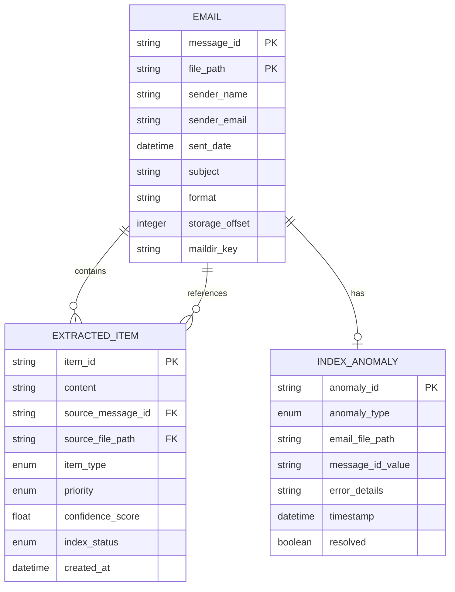

# Data Model: Item Traceability & Indexing Module

**Feature**: 001-item-traceability
**Date**: 2026-01-28
**Status**: Phase 1 Complete

## Overview

This document defines the data entities and their relationships for implementing email item traceability. The data model supports Message-ID extraction, source metadata binding, deep link generation, and index anomaly tracking.

---

## Entity Definitions

### 1. Email Message

Represents the source email from which items are extracted.

**Purpose**: Core entity for email traceability, provides the foundation for all item-to-source mappings.

**Attributes**:

| Field | Type | Required | Description | Validation |
|-------|------|----------|-------------|------------|
| `message_id` | string | ✅ Yes | RFC 5322 Message-ID (unique identifier) | Format: `<unique-id@domain>` or `unique-id@domain` |
| `sender_name` | string | ✅ Yes | Display name from From header | Decoded Unicode, max 255 chars |
| `sender_email` | string | ✅ Yes | Email address from From header | RFC 5322 addr-spec, max 254 chars |
| `sent_date` | datetime | ✅ Yes | Date/Time from Date header | ISO 8601 format, timezone-aware |
| `subject` | string | ✅ Yes | Email subject line | Decoded Unicode, max 998 chars (RFC 5322) |
| `file_path` | string | ✅ Yes | Absolute path to email file | Platform-specific path format |
| `storage_offset` | integer | ❌ No | Byte offset in mbox file (mbox only) | Non-negative integer |
| `maildir_key` | string | ❌ No | Message key in Maildir (Maildir only) | Filename without path |
| `format` | enum | ✅ Yes | Email storage format | Values: `mbox`, `maildir` |

**Relationships**:
- One-to-many with `ExtractedItem`: One email can have multiple extracted items
- Zero-to-one with `IndexAnomaly`: Email may have index anomalies if Message-ID missing/invalid

**Indexes**:
- Primary key: `message_id` + `file_path` (composite unique constraint)
- Secondary index: `sent_date` (for temporal queries)

---

### 2. Extracted Item

Represents a task, deadline, or action item extracted from an email by the AI system.

**Purpose**: Core output entity, binds AI-generated content to source email for verification.

**Attributes**:

| Field | Type | Required | Description | Validation |
|-------|------|----------|-------------|------------|
| `item_id` | string | ✅ Yes | Unique item identifier | UUID v4 |
| `content` | string | ✅ Yes | Item description (task, deadline, etc.) | Decoded Unicode, max 5000 chars |
| `source_message_id` | string | ✅ Yes | Foreign key to Email.message_id | Must exist in Email table |
| `source_file_path` | string | ✅ Yes | Foreign key to Email.file_path | Must exist in Email table |
| `item_type` | enum | ✅ Yes | Type of extracted item | Values: `task`, `deadline`, `action_item`, `other` |
| `priority` | enum | ✅ Yes | Item priority level | Values: `high`, `medium`, `low` |
| `confidence_score` | float | ✅ Yes | AI confidence in extraction accuracy | Range: 0.0 to 1.0 |
| `index_status` | enum | ✅ Yes | Traceability status | Values: `normal`, `anomaly` |
| `created_at` | datetime | ✅ Yes | Timestamp when item was created | ISO 8601, timezone-aware |

**Derived Attributes** (computed from Email relation):
- `source_metadata.sender_display`: Formatted sender string (`张三 <zhang@example.com>`)
- `source_metadata.subject_preview`: Subject truncated to 50 chars with "..."
- `source_metadata.deep_link`: Client-specific URL for opening email

**Relationships**:
- Many-to-one with `Email Message`: Each item belongs to exactly one email
- Zero-to-many with `ItemFeedback`: Users may provide feedback on item accuracy

**Indexes**:
- Primary key: `item_id`
- Foreign key: `(source_message_id, source_file_path)` → Email
- Secondary index: `created_at` (for sorting)

**Constraints**:
- `confidence_score` ≥ 0.6 for `index_status = normal`, otherwise `anomaly`
- `source_message_id` + `source_file_path` must reference existing Email record

---

### 3. Index Anomaly

Records traceability failures (missing Message-ID, extraction errors) for user awareness and debugging.

**Purpose**: Transparency and debugging - users see when traceability cannot be guaranteed.

**Attributes**:

| Field | Type | Required | Description | Validation |
|-------|------|----------|-------------|------------|
| `anomaly_id` | string | ✅ Yes | Unique anomaly identifier | UUID v4 |
| `anomaly_type` | enum | ✅ Yes | Type of index failure | Values: `missing_message_id`, `malformed_message_id`, `duplicate_detection_failure`, `file_not_found` |
| `email_file_path` | string | ✅ Yes | Path to email file | Platform-specific path format |
| `message_id_value` | string | ❌ No | Extracted Message-ID (if any) | May be malformed or partial |
| `error_details` | string | ✅ Yes | Human-readable error description | Max 1000 chars |
| `timestamp` | datetime | ✅ Yes | When anomaly was detected | ISO 8601, timezone-aware |
| `resolved` | boolean | ✅ Yes | Whether anomaly was resolved | Default: `false` |

**Relationships**:
- Zero-to-one with `Email Message`: Anomaly may be associated with an email (if partially parseable)

**Indexes**:
- Primary key: `anomaly_id`
- Secondary index: `email_file_path` (for queries by email)
- Secondary index: `timestamp` (for chronological queries)

---

## Entity Relationships

### ER Diagram



### Relationship Rules

1. **Email → Extracted Item (One-to-Many)**
   - Constraint: All items MUST have a valid source email reference
   - Cascade: If email is deleted, mark all items as `index_status = anomaly`
   - Validation: `source_message_id` + `source_file_path` must exist in Email

2. **Email → Index Anomaly (Zero-or-One)**
   - Constraint: Email with invalid Message-ID MUST have anomaly record
   - Purpose: Transparency - users see which emails lack traceability

3. **Item Confidence → Index Status (Computed)**
   - Rule: If `confidence_score < 0.6`, set `index_status = anomaly`
   - Rationale: Low confidence indicates unreliable extraction, user should verify

---

## Data Flow

### Email Processing Pipeline

```text
┌─────────────────┐
│  Email Input    │
│  (mbox/Maildir) │
└────────┬────────┘
         │
         ▼
┌─────────────────────────────┐
│  Email Parser Service       │
│  - Parse email headers      │
│  - Extract Message-ID       │
│  - Extract metadata         │
└────────┬────────────────────┘
         │
         ├─→ Valid Message-ID?
         │         │
         │         ├─ Yes ──→ Create Email Record
         │         │                   │
         │         │                   ▼
         │         │         ┌──────────────────┐
         │         │         │ Index Extractor  │
         │         │         │ - Bind Message-ID│
         │         │         │ - Pass to LLM    │
         │         │         └────────┬─────────┘
         │         │                  │
         │         │                  ▼
         │         │         ┌──────────────────┐
         │         │         │ Extracted Items  │
         │         │         │ (with source_id) │
         │         │         └──────────────────┘
         │         │
         │         └─ No ──→ Create Index Anomaly
         │                           │
         │                           ▼
         │                   ┌──────────────────┐
         │                   │ Mark with        │
         │                   │ [索引异常]       │
         │                   └──────────────────┘
         │
         ▼
┌─────────────────────────────┐
│  Report Generator           │
│  - Format source metadata   │
│  - Generate deep links      │
│  - Summarize anomalies      │
└─────────────────────────────┘
```

---

## Database Schema (SQLite)

### Tables

#### email_messages
```sql
CREATE TABLE email_messages (
    message_id TEXT NOT NULL,
    file_path TEXT NOT NULL,
    sender_name TEXT NOT NULL,
    sender_email TEXT NOT NULL,
    sent_date TEXT NOT NULL,  -- ISO 8601 datetime
    subject TEXT NOT NULL,
    format TEXT NOT NULL,  -- 'mbox' or 'maildir'
    storage_offset INTEGER,
    maildir_key TEXT,
    created_at TEXT NOT NULL DEFAULT CURRENT_TIMESTAMP,
    PRIMARY KEY (message_id, file_path)
);

CREATE INDEX idx_email_sent_date ON email_messages(sent_date);
```

#### extracted_items
```sql
CREATE TABLE extracted_items (
    item_id TEXT NOT NULL PRIMARY KEY,
    content TEXT NOT NULL,
    source_message_id TEXT NOT NULL,
    source_file_path TEXT NOT NULL,
    item_type TEXT NOT NULL,  -- 'task', 'deadline', 'action_item', 'other'
    priority TEXT NOT NULL,   -- 'high', 'medium', 'low'
    confidence_score REAL NOT NULL,
    index_status TEXT NOT NULL,  -- 'normal', 'anomaly'
    created_at TEXT NOT NULL DEFAULT CURRENT_TIMESTAMP,
    FOREIGN KEY (source_message_id, source_file_path)
        REFERENCES email_messages(message_id, file_path)
        ON DELETE CASCADE
);

CREATE INDEX idx_item_source ON extracted_items(source_message_id, source_file_path);
CREATE INDEX idx_item_created ON extracted_items(created_at);
```

#### index_anomalies
```sql
CREATE TABLE index_anomalies (
    anomaly_id TEXT NOT NULL PRIMARY KEY,
    anomaly_type TEXT NOT NULL,  -- 'missing_message_id', etc.
    email_file_path TEXT NOT NULL,
    message_id_value TEXT,
    error_details TEXT NOT NULL,
    timestamp TEXT NOT NULL DEFAULT CURRENT_TIMESTAMP,
    resolved BOOLEAN NOT NULL DEFAULT 0
);

CREATE INDEX idx_anomaly_path ON index_anomalies(email_file_path);
CREATE INDEX idx_anomaly_time ON index_anomalies(timestamp);
```

---

## Validation Rules

### Email Message
1. `message_id` must match RFC 5322 format (with or without angle brackets)
2. `sender_email` must be valid RFC 5322 addr-spec
3. `sent_date` must be parseable ISO 8601 datetime
4. `format` must be either `mbox` or `maildir`
5. If `format = mbox`, `storage_offset` is required
6. If `format = maildir`, `maildir_key` is required

### Extracted Item
1. `source_message_id` + `source_file_path` must exist in `email_messages`
2. `confidence_score` must be between 0.0 and 1.0
3. `index_status` is automatically set based on `confidence_score`:
   - `confidence_score < 0.6` → `index_status = anomaly`
   - `confidence_score ≥ 0.6` → `index_status = normal`
4. `item_type` must be one of: `task`, `deadline`, `action_item`, `other`
5. `priority` must be one of: `high`, `medium`, `low`

### Index Anomaly
1. `anomaly_type` must be one of:
   - `missing_message_id`
   - `malformed_message_id`
   - `duplicate_detection_failure`
   - `file_not_found`
2. If `anomaly_type = missing_message_id`, `message_id_value` must be NULL
3. If `anomaly_type = malformed_message_id`, `message_id_value` must be present

---

## Migration Strategy

### Version 1.0 → 1.1 (Future)

If adding new fields to `ExtractedItem` (e.g., user feedback):
```sql
ALTER TABLE extracted_items ADD COLUMN user_feedback TEXT;
ALTER TABLE extracted_items ADD COLUMN feedback_timestamp TEXT;
```

### Schema Versioning

Include `schema_version` in `app_config.json`:
```json
{
  "schema_version": "1.0",
  "traceability": {
    "message_id_validation_rules": {...}
  }
}
```

On startup, check `schema_version` and run migrations if needed.

---

## Summary

**Entities**: 3 core entities (Email Message, Extracted Item, Index Anomaly)
**Relationships**: One-to-many (Email → Items), Zero-or-one (Email → Anomaly)
**Storage**: SQLite database with proper foreign key constraints
**Indexes**: Optimized for common queries (by Message-ID, file path, timestamp)
**Validation**: Application-layer validation using Pydantic models
**Migration**: Schema versioning in `app_config.json` with automated migrations
